# 控件属性面板 — 设计说明与使用手册

> **版本：** V1.4（2026-08-01）  
> **截图状态：** ✅ `docs/beken界面/属性面板/` 下 38 种控件 + **页面** 属性面板分段截图已就绪（`.tmp/capture_component_props.py --shot-only` / `--page-only`）。  
> **适用产品：** ForgeUI Designer（`@forgeui/designer`）  
> **Beken 参照：** `docs/beken界面/属性面板/`、`属性面板说明.txt`  
> **AI 规格分析：** `ref/beken/.../ai-skill/beken-lvgl-ui-designer/component-specs/`（38 控件）  
> **研发详设：** `docs/嵌入式UI工具_软件详细设计说明.md` §9.7.4、§3.5.2；**模块补充详设** `docs/嵌入式UI工具_控件属性面板详细设计说明.md`  
> **需求追溯：** FR-016（属性检查器）、FR-017（Part/State 样式）、FR-010a（与控件库边界）

---

## 1. 概述

**属性面板**与**事件面板**共用工作区右栏，通过顶栏 **「属性 | 事件」** Tab 切换（对标 Beken）；同一时刻只显示其一。与左侧**控件库**分工明确：

| 区域 | 职责 | 不得承担 |
|------|------|----------|
| 控件库（左栏） | 从注册表**选型并添加**新控件 | 编辑已选控件字段 |
| 属性 Tab（`PropPanel`） | 编辑选中节点的 `frame` / `props` / `style` | 切换控件库显隐 |
| 事件 Tab（`EventPanel`） | 编辑 `events[]` | 样式 Part/State 编辑（V1 前可只读提示） |

在画布或**页面组件树**中单击控件后，右侧属性区即时同步；修改经 `project:updateNode` 写回 `screens/*.json`，并标记工程为脏（`*`），需**存档**后落盘。

---

## 2. 面板布局

### 2.1 在工作区中的位置

```
┌──────────┬─────────────────────────────┬──────────────┐
│ 控件库   │         画布                │ 属性 | 事件  │
│ 页面树   │                             │  ─────────   │
│          │                             │  位置信息    │
│          │                             │  属性        │
│          │         日志面板            │  行为配置    │
│          │                             │  样式        │
│          │                             │              │
└──────────┴─────────────────────────────┴──────────────┘
         （「事件」Tab 选中时，上方面板区替换为事件列表）
```

- **默认宽度：** 300px（详设 §9.5）。
- **Tab 切换（对标 Beken）：** 右栏顶栏为 **「属性 | 事件」** 两个 Tab，点击切换；当前 Tab 高亮（底部 accent 色下划线）。切换状态保存在 `uiStore.rightTab`（`props` / `events`）。
- **实现：** `InspectorPanel.vue` 承载 Tab 栏；其下按 Tab 显示 `PropPanel` 或 `EventPanel`（`DesignerWorkbench.vue` 右栏挂载 `InspectorPanel`）。

### 2.2 面板头部

| 元素 | Beken | ForgeUI |
|------|-------|---------|
| 属性 / 事件 Tab | 顶栏点击切换 | ✓ 同结构 Tab |
| 控件类型徽标 | 图标 + 中文类型名（如「按钮」） | 只读 `type` + 中文标签（来自 WidgetRegistry） |
| 控件 ID | `ID: Page_1_button_1` | 只读 `id`（工程内稳定，用于 CodeGen 符号） |
| 显示名 | 大纲/树中的 `name` | 可编辑 `name`（不影响 C 符号） |

> 控件类型、ID、显示名位于 **属性 Tab** 内容区顶部；**事件 Tab** 无此头部，直接展示事件列表。

### 2.3 分组结构（属性 Tab 滚动区）

**属性 Tab** 内（`PropPanel`）按 **折叠分组** 纵向排列，顺序固定：

| 序号 | 分组名 | 说明 | 分期 |
|------|--------|------|------|
| 1 | **位置信息** | 锚点、X/Y、宽/高、旋转、布局类型 | MVP：X/Y/W/H；V1：锚点/旋转/布局 |
| 2 | **属性** | 控件类型专用字段（文本、图片路径等） | MVP：按注册表动态表单 |
| 3 | **行为配置** | 对象标志、对象状态 | V1 |
| 4 | **样式** | Part × State × 样式子组 | MVP：main/default 常用项；V1：完整 Part/State |

各分组标题左侧为蓝色圆点，与 Beken 视觉一致；样式子组右侧 **显示 / 隐藏**：显示时展开编辑区并参与渲染，隐藏时收起且不参与渲染（`disabledSubgroups`，对标 BK `enabledGroups`）。

---

## 3. 通用操作

### 3.1 选中控件

1. 在**画布**上单击控件，或  
2. 在左侧**控件树**中单击节点。  

未选中时属性区显示「未选中控件」；在**页面树**选中 **screen** 根节点（如 `Page_1`）时，属性首组为 **「屏幕信息」**（宽/高，无 3×3 锚点格），可编辑页面级几何与背景，**不可删除**页面。

**页面属性 Beken 截图：**

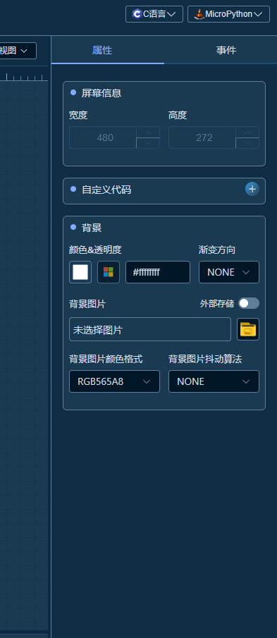

### 3.2 修改几何（位置信息）

| 字段 | 含义 | 写入 JSON |
|------|------|-----------|
| X | 相对**父容器**左上角水平偏移（px） | `frame.x` |
| Y | 相对父容器垂直偏移（px） | `frame.y` |
| 宽 | 控件宽度（px） | `frame.w` |
| 高 | 控件高度（px） | `frame.h` |

- 亦可在画布上**拖拽移动**；选中后出现 **8 个纯色缩放点**（四角 + 四边中点）及**顶部旋转锚点**（竖线 + 带旋转箭头的圆柄，对标 Beken；手柄在控件外壳层，不被文本裁剪挡住）；左边/上边缩放会同步改 X/Y；旋转绕控件中心，与属性面板「旋转 (°)」同步。  
- 画布拖拽松手后写入历史栈，可用 **Ctrl+Z** 撤回。  
- **3×3 方位格**：点击将控件对齐到**父容器**对应角/边/心（模块详设 §3.5）；九格指示图形必须分方位，禁止九点同图。

**Beken 参照图（位置信息区）：**

- 按钮：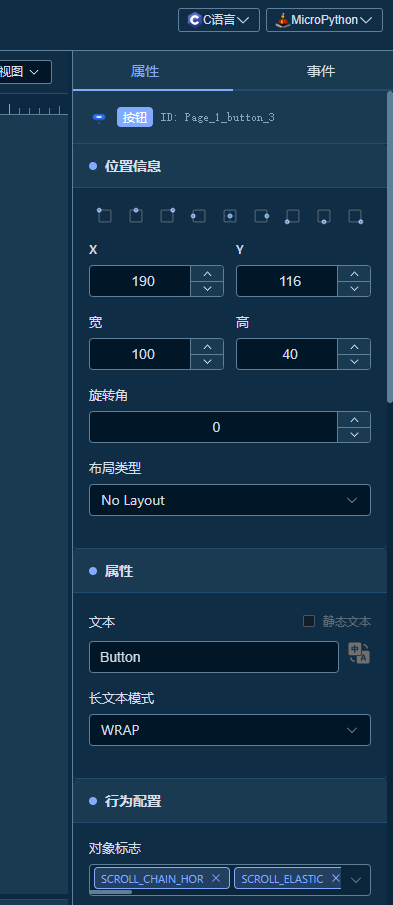  
- 标签：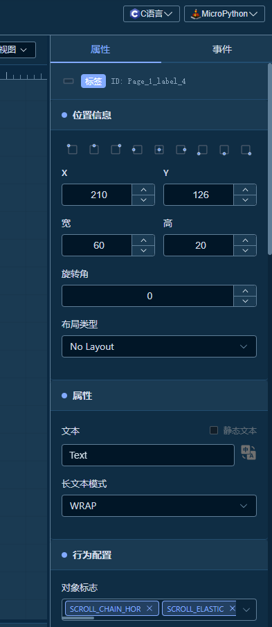  
- 图片：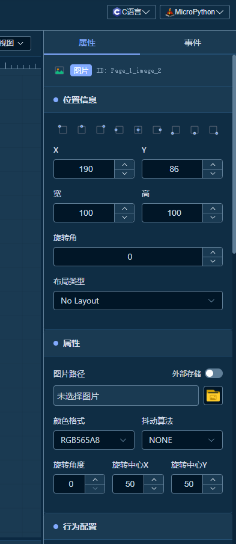

**相关：** 旋转角、布局类型（Flex/Grid）见「位置信息」分组；多选对齐见控件菜单（FR-013b），与 3×3 父容器吸附不同。

### 3.3 修改专用属性

字段由 **WidgetRegistry**（`packages/core/src/widgets.ts`）驱动：仅显示当前 `type` 支持的 `props`，变更写入 `node.props`。

### 3.4 修改样式

MVP 编辑 `style.main.default` 下常用键；V1 通过 **PART** / **STATE** 下拉切换后编辑对应子组。

样式面板右上角 **保存 / 样式库** 对标 Beken（FR-018）：保存打开「保存样式」对话框（名称/描述/预览）；样式库打开列表（缩略图、应用、删除）。落盘为 `project.themes[]`，节点可挂 `styleRef`。

### 3.5 删除控件

- 属性面板底部 **「删除控件」**（非 screen），或  
- 控件树 **⋯ → 删除**。  

删除前无二次确认（V1 可加）；操作可撤回。

### 3.6 存档与预览

属性修改仅更新内存与脏标记；**生成代码 / 编译 / 模拟运行** 前会自动存档（若已改动）。手动存档：**Ctrl+S** 或顶栏「存档」。

---

## 4. 分组字段详述

### 4.1 位置信息（控件）

选中**控件**时，属性首组为 **「位置信息」**，左侧有 **3×3 容器方位格**（对标 Beken）。

| 字段 | Beken | ForgeUI | 说明 |
|------|-------|---------|------|
| 3×3 方位格 | ✓ | ✓ | **示意点在格内对应角/边/心**；点击将控件**吸附到父容器**该方位（见模块详设 §3.5） |
| X / Y | ✓ | ✓ | 相对父容器左上角，整数 px |
| 宽 / 高 | ✓ | ✓ | 最小约 16px（画布约束） |
| 旋转角 | ✓ | ✓ | `frame.rotation` |
| 布局类型 | No Layout 等 | ✓（容器） | Flex/Grid 等 |

**3×3 点击规则（锁定）：**

1. 参考系 = **直接父容器**（页面子控件 → 屏幕；嵌套子控件 → 父控件 `w×h`）。  
2. 左上 / 上中 / 右上 / … / 右下共九种，计算见《控件属性面板详细设计说明》§3.5.1。  
3. **不是**改锚点枢轴、画面不动；**不是**相对随意空白位移。  

**问题对照图：** 错误示意（九点全居中）见 `docs/工具问题/控件属性位置问题/控件属性位置信息的图示九个点.png`。

**Beken 参照图（位置信息区）：**

- 按钮：  
- 标签：  
- 图片：

### 4.1.1 屏幕信息（页面）

在**页面树**选中 screen 根节点时，首组为 **「屏幕信息」**（无锚点格），仅含页面分辨率等字段：

| 字段 | 含义 | 写入 JSON |
|------|------|-----------|
| 宽 | 页面逻辑宽度（px） | `screen.width` |
| 高 | 页面逻辑高度（px） | `screen.height` |

另含 **自定义代码**、**背景** 等分组（见 §3.1 页面截图）。

### 4.2 属性（按控件类型）

见 **§5** 全组件专章（§5.0 总览 + §5.1～§5.13 分类型说明）。

### 4.3 行为配置

| 字段 | Beken 示例 | ForgeUI | 说明 |
|------|------------|---------|------|
| 对象标志 | `SCROLL_CHAIN_HOR`、`CLICKABLE`… | V1 | 映射 LVGL `lv_obj_add_flag` |
| 对象状态 | Select State | V1 | 编辑器预览用状态，非样式 State |

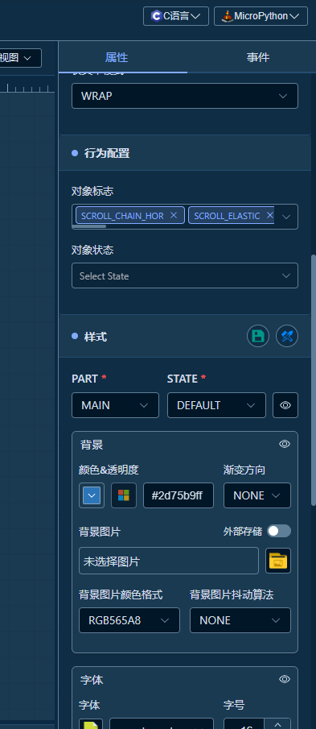

### 4.4 样式

#### 4.4.1 Part 与 State 选择器

| 控件 | PART（部件） | STATE（状态） |
|------|--------------|---------------|
| 按钮 / 标签 / 图片 / 容器 | MAIN | default、pressed、focused、disabled、checked… |
| 滑块 / 开关 | MAIN、INDICATOR、KNOB | 同上 |
| 进度条 / 加载动画 | MAIN、INDICATOR | 同上 |
| 圆弧 | MAIN、INDICATOR、KNOB | 同上 |
| 下拉菜单 | MAIN、MAIN_LIST、SELECTED_LIST | 同上 |
| 滚轮 | MAIN、SELECTED | 同上 |
| 列表 | MAIN、MAIN_BUTTON、MAIN_ITEM、SCROLLBAR | 同上 |
| 表格 | MAIN、ITEMS | 同上 |
| 标签视图 | MAIN、MAIN_TABBAR、MAIN_TABBARITEM | 同上 |
| 窗口 | MAIN、HEADER、CONTENT、BUTTON | 同上 |
| 消息框 | MAIN、HEADER、CONTENT、FOOTER… | 同上 |
| 文本域 | MAIN、SCROLLBAR | 同上 |
| 图表 | MAIN、（ITEMS / SERIES） | 同上 |

- **STATE *** 始终显示（含按钮/标签等仅 `main` 的控件，用于编辑 pressed/disabled 等）。  
- **PART *** 仅多 Part 控件显示；单 Part 时固定 MAIN。  
- 右侧样式子组 **显示 / 隐藏**：展开编辑并参与渲染 / 收起且不参与（见 §4.4.2）。

#### 4.4.2 样式子组

| 子组 | 主要字段 | JSON 键（示例） | 分期 |
|------|----------|-----------------|------|
| **背景** | 颜色&透明度、渐变、背景图 | `bg_color`、`bg_grad_dir`、`bg_img_src` | MVP：`bg_color` |
| **字体** | 字体、字号、颜色、对齐 | `text_font`、`text_color`、`text_align` | MVP：`text_color`；字体 V1 |
| **间距** | 字符间距、行间距 | `text_letter_space`、`text_line_space` | V1（对标 BK `space`） |
| **边框** | 宽度、颜色、圆角、裁剪圆角 | `border_width`、`border_color`、`radius`、`clip_corner` | MVP：`radius` |
| **内边距** | 上/下/左/右 | `pad_top`… | V1 |
| **阴影** | 颜色、宽度、扩散、X/Y 偏移 | `shadow_color`、`shadow_width`… | V1 |
| **外轮廓** | 宽度、颜色、透明度 | `outline_*` | V1 |
| **Image**（图片控件专用） | 重染色、图片透明度 | `img_recolor`、`img_opa` | V1 |

颜色输入格式：**#RRGGBBAA**（8 位十六进制，与 Beken 一致），例如纯白 `#ffffffff`。

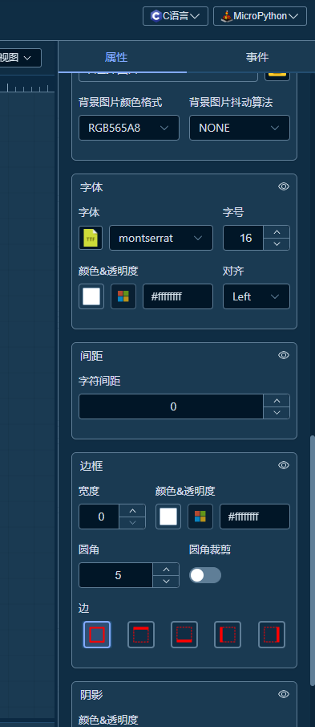  
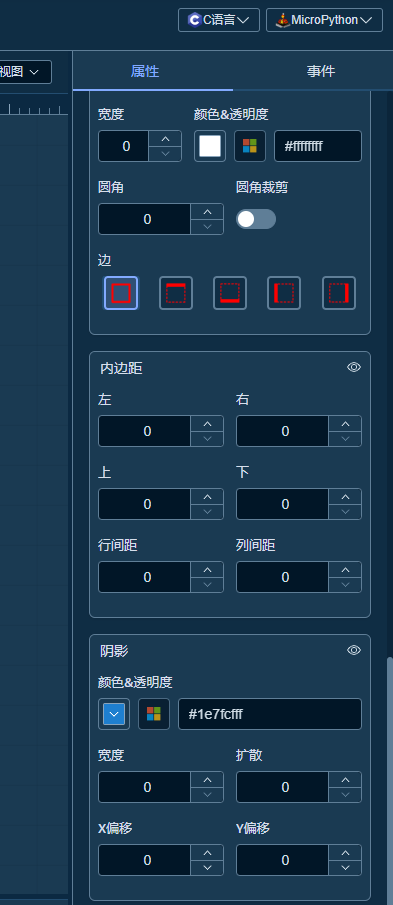

---

## 5. 按控件类型说明

### 5.0 组件库属性面板总览

下表依据 Beken **AI component-specs**（38 种可添加控件）整理；**page**（页面根）无独立控件库条目；在**页面树**选中时编辑 **屏幕信息** 与背景（§3.1、§11.1）。

| 分类 | 中文名 | type | 专用属性 | Style Part | extraData 编辑器 |
|------|--------|------|----------|------------|------------------|
| 布局 | 容器 | `obj` | — | main、scrollbar | — |
| 布局 | 窗口 | `win` | title、header_height | main、main_header、main_content、main_button | ✓ |
| 数据展示 | 标签 | `label` | text、is_text_static、long_mode | main | — |
| 数据展示 | 文本组 | `spangroup` | — | main | ✓ |
| 数据展示 | 表格 | `table` | row_cnt、col_cnt | main、items | ✓ |
| 数据展示 | 列表 | `list` | — | main、main_button、main_item、scrollbar | ✓ |
| 按钮 | 按钮 | `button` | text、long_mode | main | — |
| 按钮 | 图片按钮 | `imagebutton` | text、src_pressed、src_released、src_checked_released… | main | — |
| 按钮 | 按钮矩阵 | `buttonmatrix` | — | main、items | ✓ |
| 表单输入 | 文本域 | `textarea` | text、placeholder、password_mode、password_bullet… | main、scrollbar | — |
| 表单输入 | 复选框 | `checkbox` | text | main、indicator | — |
| 表单输入 | 开关 | `switch` | — | main、indicator、knob | — |
| 表单输入 | 滑块 | `slider` | range、value、start_value、mode | main、indicator、knob | — |
| 表单输入 | 下拉菜单 | `dropdown` | — | main、main_list、selected_list、scrollbar_list | ✓ |
| 表单输入 | 滚轮 | `roller` | visible_row_count、mode | main、selected | ✓ |
| 表单输入 | 数字输入框 | `spinbox` | value、range_min、range_max、digit_format… | main、cursor | — |
| 图片媒体 | 图片 | `image` | img_path、rotate、pivot_x、pivot_y | main | — |
| 图片媒体 | 动画图片 | `animimg` | duration、reverse、reverse_delay、reverse_duration… | main | ✓ |
| 图片媒体 | 画布 | `canvas` | bg_color、bg_opa | main | — |
| 可视化 | 圆弧 | `arc` | range、value、bg_start_angle、bg_end_angle… | main、indicator、knob | — |
| 可视化 | 线条 | `line` | y_invert | main | ✓ |
| 可视化 | 二维码 | `qrcode` | qr_size、qr_data、dark_color、light_color | main | — |
| 可视化 | 条形码 | `barcode` | rotation、barcode_data、scale、dark_color… | main | — |
| 可视化 | LED | `led` | bright、color | main | — |
| 反馈 | 进度条 | `bar` | range、value、start_value、anim_duration… | main、indicator | — |
| 反馈 | 加载动画 | `spinner` | arc_length、anim_time | main、indicator | — |
| 反馈 | 消息框 | `msgbox` | title、text | main、main_header、main_content、main_footer、main_headerbutton、main_footerbutton | ✓ |
| 导航 | 菜单 | `menu` | — | main、main_sidebar、main_item | ✓ |
| 导航 | 标签视图 | `tabview` | tab_bar_size、tab_bar_position | main、main_tabbar、main_tabbaritem | ✓ |
| 导航 | 平铺视图 | `tileview` | scrollbar_mode | main、scrollbar | ✓ |
| 高级 | 数字时钟 | `digitalclock` | initial_time、show_second、use_ampm | main | — |
| 高级 | 日历 | `calendar` | today_year、today_month、today_day、showed_year… | main、main_header、main_buttonmatrix、items_buttonmatrix | ✓ |
| 高级 | 键盘 | `keyboard` | mode | main、items | — |
| 高级 | 刻度 | `scale` | tick_cnt、major_tick_nth、rotation、angle_range… | main、items、indicator | ✓ |
| 图表 | 线图 | `linechart` | point_count、primary_x、primary_y、enable_secondary_y… | main | ✓ |
| 图表 | 柱状图 | `barchart` | point_count、primary_x、primary_y、enable_secondary_y… | main | ✓ |
| 图表 | 散点图 | `scatterchart` | point_count、primary_x、primary_y、enable_secondary_y… | main、items | ✓ |
| 图表 | chart | `chart` | point_count、div_line_count_h、div_line_count_v、range_min… | main、series | — |

#### 5.0.1 分析方法（对标 Beken AI 接入文档）

1. **权威来源：** `ref/beken/lvgl_ui_designer_2.0.3/resources/ai-skill/beken-lvgl-ui-designer/component-specs/` 中各 `{type}/{type}.md`；运行时以 MCP `get_component_type_spec` 为准（见 `component-specs/README.md`）。
2. **面板分组映射：**
   - **位置信息** ← `layout` 类属性：`x`、`y`、`width`、`height`（及 V1 锚点/旋转/布局）。
   - **属性** ← `general` 类组件字段（如 `text`、`value`、`range`）。
   - **行为配置** ← `behavior` 类：`flags`（对象标志）、`state`（预览状态）。
   - **样式** ← `style.parts[]`：按 **PART × STATE** 编辑 `background` / `font` / `border` 等子组。
   - **扩展数据** ← `extraData`：列表项、Span 段、图表 series、菜单 pages 等；Beken 在 **属性** 分组内提供列表/表格编辑器，**非**子控件树。
3. **属性 vs 样式：** 组件值走 `properties`（ForgeUI `props`）；视觉走 `style`（ForgeUI `style`）。`Common/Range` 在 Beken 为 `{min,max}` 对象，勿写逗号字符串（见 AI `style-guidelines.md`）。
4. **ForgeUI 分期：** 表内「ForgeUI」列：`props.*` 表示 MVP 已支持或计划同名；`V1` 表示待注册表与 UI 补齐。

#### 5.0.2 多 Part 控件速查

| 控件 | PART | 典型用途 |
|------|------|----------|
| 滑块 / 进度条 / 开关 | main、indicator、knob | 轨道、填充、拖柄 |
| 下拉菜单 | main、main_list、selected_list | 收起框、列表、选中行 |
| 列表 | main、main_button、main_item | 容器、按钮行、文本行 |
| 表格 | main、items | 外框、单元格 |
| 标签视图 | main、main_tabbar、main_tabbaritem | 内容、标签栏、标签项 |
| 窗口 | main、main_header、main_content、main_button | 外框、标题栏、客户区、按钮 |
| 消息框 | main、main_header、main_content、main_footer… | 对话框各区域 |
| 文本域 | main、scrollbar | 输入区、滚动条 |

以下 §5.1～§5.3 为按钮/标签/图片的**详细操作示例**；§5.4 起为其余控件的字段级说明。

### 5.1 按钮（button）

**Beken 参照：** `属性面板/按钮属性/按钮属性-1.png`～`按钮属性-6.png`、`-全窗.png`

#### 5.1.1 位置信息

与 §4.1 相同。Beken 示例：X=190，Y=116，宽=100，高=40。

#### 5.1.2 专用属性

| 字段 | Beken UI | ForgeUI 字段 | 默认值 | 说明 |
|------|----------|--------------|--------|------|
| 文本 | 文本 + 静态文本勾选 | `props.text` | `"Button"` | 按钮显示文字；画布即时更新 |
| 长文本模式 | WRAP / DOTS / SCROLL / … | `props.long_mode` | `WRAP` | 画布+模拟：WRAP 框内换行裁切；DOTS 省略；CLIP 裁剪（子 label 宽 100%，对标 BK） |
| 多语言 | 文本框右侧图标 | V2 | — | i18n 键引用 |

**回归测试：** `tests/designer_button_prop_display_bk.test.ts` 按 Beken 对照清单逐项断言画布可用（几何/属性/行为/样式共 38 项）。

**画布可见性（FR-016e，对标 Beken，必须实际能用）：**

| 操作 | 期望画布效果 |
|------|----------------|
| 样式 → 背景 → 选背景图片 | 按钮区域显示图片（不是只有路径写入） |
| 样式 → 字体 → 字号 | 文字大小变化（如 16→24）；生成后模拟字号一致 |
| 样式 → 字体 → 字体（已导入） | 字形切换（需先资源管理导入字体） |
| 样式 → 字体 → 对齐 Left/Right | 文案靠左/靠右 |
| 样式 → 字体 → 颜色 | 文字颜色变化 |

**CodeGen：** 按钮子 label 定宽 `LV_PCT(100)` + `long_mode`（见 `tests/codegen_long_mode_bk.test.ts`）。


#### 5.1.3 样式建议（对标 Beken 默认）

| Part | State | 常用设置 |
|------|-------|----------|
| MAIN | DEFAULT | 背景 `#2d75b9ff`，圆角 5，文字 `#ffffffff` |
| MAIN | PRESSED | 背景加深，可选 PRESSED 态 |
| MAIN | DISABLED | 降透明度或灰显 |

  
  
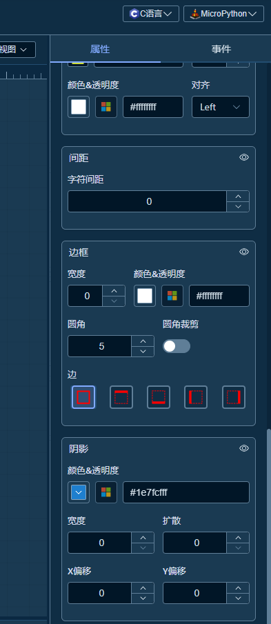  
  
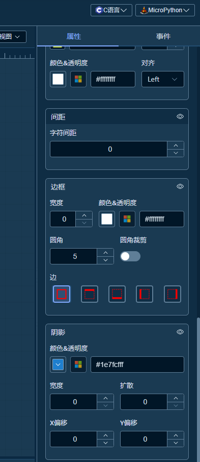

#### 5.1.4 操作示例：修改按钮文字

1. 选中画布上的按钮。  
2. 在 **属性 → 文本** 中输入新文字。  
3. 失焦或回车后画布标签即时更新。  
4. **Ctrl+S** 存档。

#### 5.1.5 JSON 片段示例

```json
{
  "type": "button",
  "id": "btn_ok",
  "name": "确定按钮",
  "frame": { "x": 190, "y": 116, "w": 100, "h": 40 },
  "props": { "text": "确定" },
  "style": {
    "main": {
      "default": { "bg_color": "#2d75b9ff", "text_color": "#ffffffff", "radius": 5 },
      "pressed": { "bg_color": "#1e5a94ff" }
    }
  },
  "events": [],
  "children": []
}
```

---

### 5.2 标签（label）

**Beken 参照：** `属性面板/标签属性/标签属性-1.png`～`标签属性-6.png`、`-全窗.png`

#### 5.2.1 专用属性

| 字段 | Beken UI | ForgeUI 字段 | 默认值 | 说明 |
|------|----------|--------------|--------|------|
| 显示名 | （名称/树） | `node.name` | — | **大纲显示名**，不是画布文案 |
| 文本 | 文本 | `props.text` | `"Label"` | **画布与生成代码**显示内容 |
| 静态文本 | 勾选框 | `props.is_text_static` | `false` | true → CodeGen `lv_label_set_text_static` |
| 长文本模式 | WRAP / DOTS / … | `props.long_mode` | `"WRAP"` | **画布+模拟**：WRAP 框内换行且超出高度裁切；DOTS 省略；SCROLL/SCROLL_CIRCULAR 画布为 CSS 预览、以模拟为准；CLIP 裁剪 |

**文本对齐不在属性组：** 对标 Beken，在 **样式 → 字体 → 对齐**（`style.*.text_align`）；画布须即时可见。


#### 5.2.2 样式要点

标签样式以 **字体** 子组为主：

| 字段 | Beken 示例 | JSON 键 |
|------|------------|---------|
| 字体 | montserrat | `text_font`（V1） |
| 字号 | 14（未设时）/ 面板值 | `text_font_size` | 画布与模拟默认 14；行高按 LVGL montserrat（14→16）；CodeGen 按 size 选字 |
| 字体 | Montserrat（未设时） | `text_font` | 画布默认 Montserrat（对齐 `LV_FONT_DEFAULT`）；导入资源后换族 |
| 颜色&透明度 | `#000000ff` | `text_color` |
| 对齐 | Left | `text_align` |
| 字符间距 | 0 | `text_letter_space`（V1） |

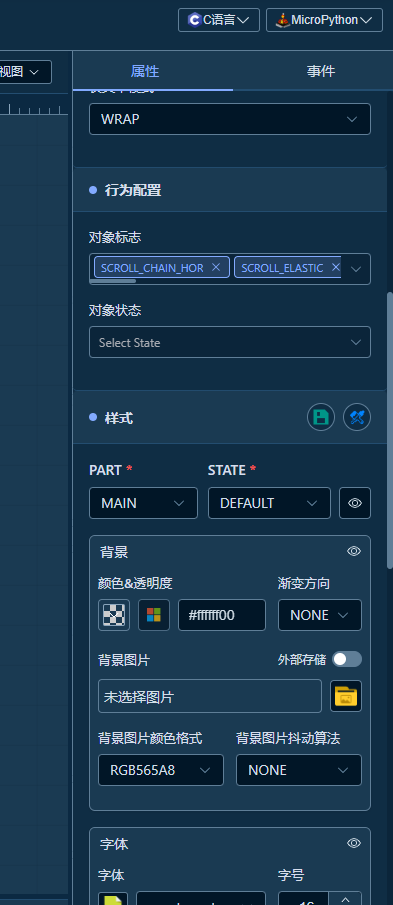  
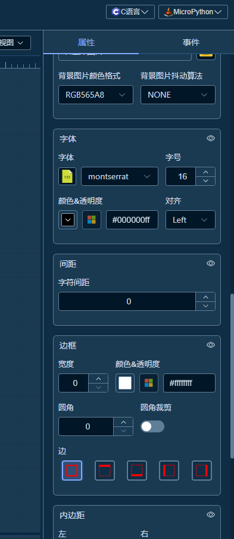

#### 5.2.3 操作示例：白色标题字

1. 选中标签。  
2. **样式 → PART=MAIN，STATE=DEFAULT → 字体 → 颜色&透明度** 设为 `#ffffffff`。  
3. （MVP）若仅暴露 `text_color` 单字段，在该字段输入 `#ffffffff`。  
4. 存档后重新生成并预览，确认仿真窗口文字为白色。

---

### 5.3 图片（image）

**Beken 参照：** `属性面板/图片属性/图片属性-1.png`～`图片属性-3.png`

#### 5.3.1 专用属性

| 字段 | Beken UI | ForgeUI 字段 | 说明 |
|------|----------|--------------|------|
| 图片路径 | 未选择图片 + 文件夹 | `props.src` | 相对 `assets/` 或工程内路径 |
| 外部存储 | 开关 | V1 | 资源不打包进工程 |
| 颜色格式 | RGB565A8 | V1（导出管线） | 与平台纹理格式相关 |
| 抖动算法 | NONE | V1 | 量化导出选项 |
| 旋转角度 / 旋转中心 X/Y | 0 / 50 / 50 | V1 | 图片自身变换 |


#### 5.3.2 选择图片步骤

1. 顶栏 **资源管理** 导入 PNG 等到 `assets/`。  
2. 选中图片控件。  
3. **属性 → 图片路径** 点击文件夹图标，从资源列表选择（MVP 可手填 `props.src` 路径）。  
4. 画布显示占位或缩略图；仿真以 LVGL 解码为准。

#### 5.3.3 样式要点

图片控件除通用 **背景 / 边框 / 阴影** 外，另有 **Image** 子组：

| 字段 | 说明 |
|------|------|
| 重染色&透明度 | `img_recolor`，整体调色 |
| 图片透明度 | `img_opa`，0～255 |

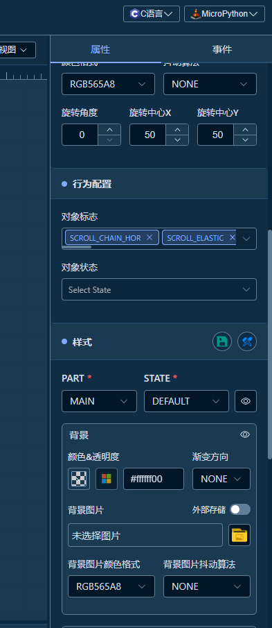  
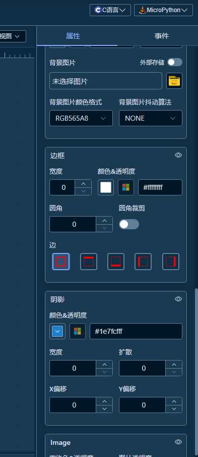

#### 5.3.4 JSON 片段示例

```json
{
  "type": "image",
  "id": "img_logo",
  "name": "Logo",
  "frame": { "x": 190, "y": 86, "w": 100, "h": 100 },
  "props": { "src": "assets/logo.png" },
  "style": {
    "main": {
      "default": { "img_opa": 255 }
    }
  },
  "events": [],
  "children": []
}
```


### 5.4 布局类
### 5.4.1 容器（`obj`）

**Beken 参照：** `ref/beken/.../component-specs/obj/obj.md`；截图 `docs/beken界面/属性面板/容器属性/容器属性-1.png`～`容器属性-3.png`、`-全窗.png`

**Beken 截图：**

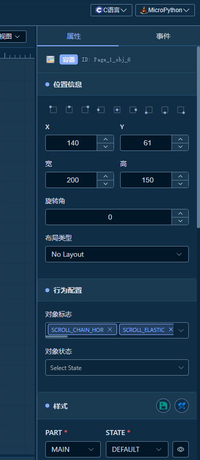
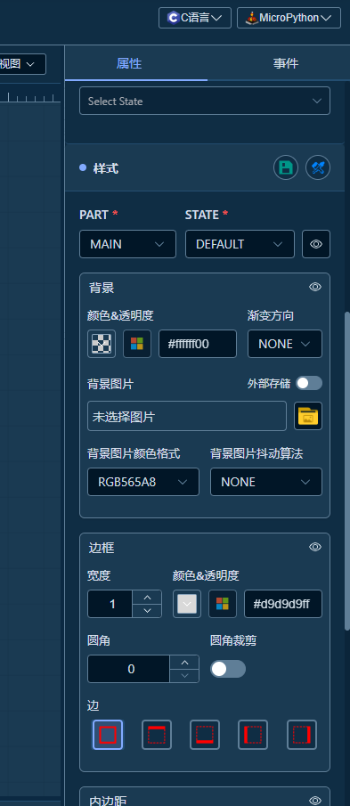
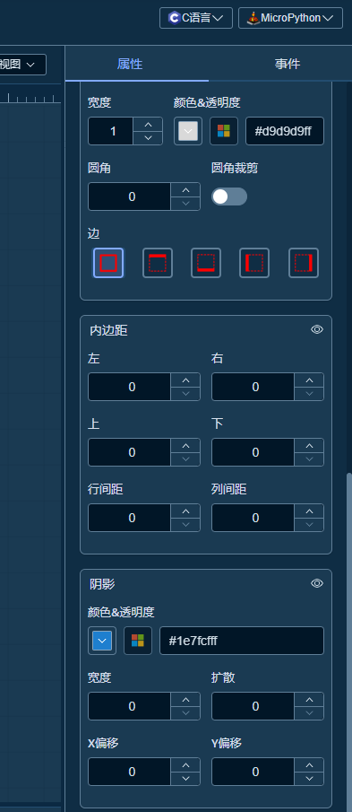

#### 专用属性

（无 `general` 分组专用字段；面板仍含 **位置信息**、**行为配置**、**样式**。）

#### 样式 Part

`main`（MAIN）、`scrollbar`（SCROLLBAR）

> 通用样式子组（背景、字体、边框、阴影、内边距等）见 §4.4.2；多 Part 控件请在 **PART** 下拉中分别编辑 `main` / `indicator` / `knob` 等。

### 5.4.2 窗口（`win`）

**Beken 参照：** `ref/beken/.../component-specs/win/win.md`；截图 `docs/beken界面/属性面板/窗口属性/窗口属性-1.png`～`窗口属性-3.png`、`-全窗.png`

**Beken 截图：**

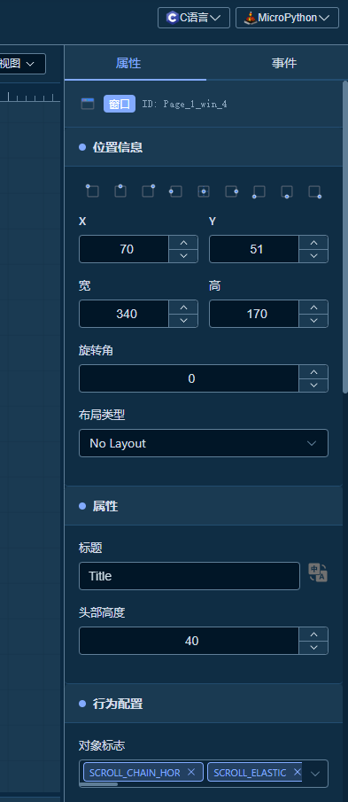
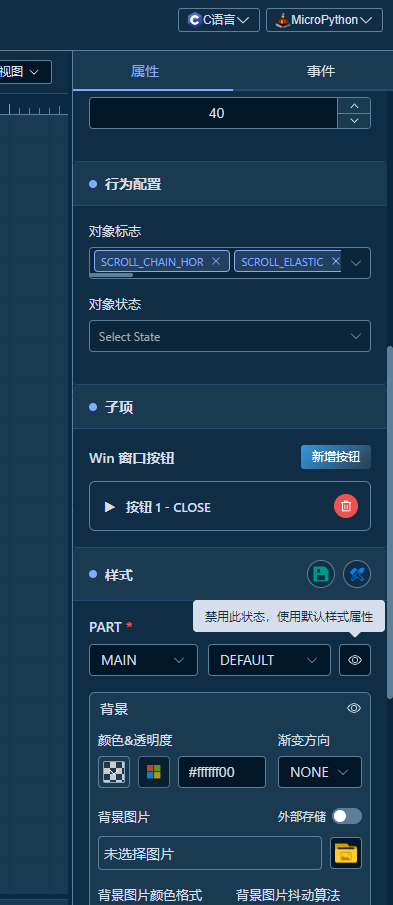
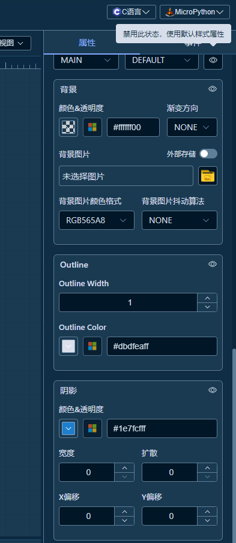

#### 专用属性

| 字段 | Beken UI | 类型 | 默认值 | ForgeUI |
|------|----------|------|--------|---------|
| `title` | 标题 | Common/String | "Title" | V1 |
| `header_height` | 标题栏高度 | Common/Number | 40 | V1 |

**扩展数据（extraData，属性面板内嵌编辑器）：**

- `buttons[]`: header buttons.
- `buttons[].icon_type`: currently `"symbol"`.
- `buttons[].icon`: built-in LVGL symbol short name such as `"CLOSE"`. Must be from `allowedLvglSymbols` (see `lvgl-symbols.md`).
- `buttons[].width`: header button width.

#### 样式 Part

`main`（MAIN）、`main_header`（HEADER）、`main_content`（CONTENT）、`main_button`（BUTTON）

> 通用样式子组（背景、字体、边框、阴影、内边距等）见 §4.4.2；多 Part 控件请在 **PART** 下拉中分别编辑 `main` / `indicator` / `knob` 等。

### 5.5 数据展示类
### 5.5.1 文本组（`spangroup`）

**Beken 参照：** `ref/beken/.../component-specs/spangroup/spangroup.md`；截图 `docs/beken界面/属性面板/文本组属性/文本组属性-1.png`～`文本组属性-6.png`、`-全窗.png`

**Beken 截图：**

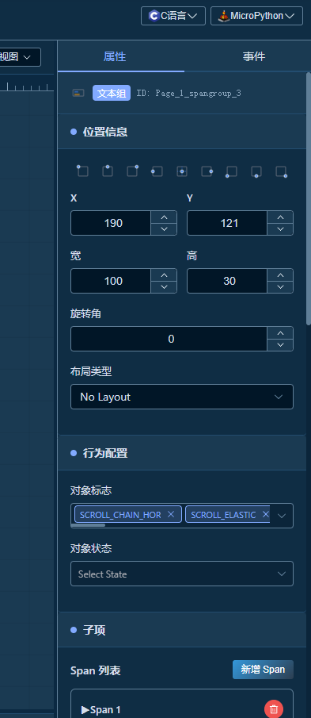
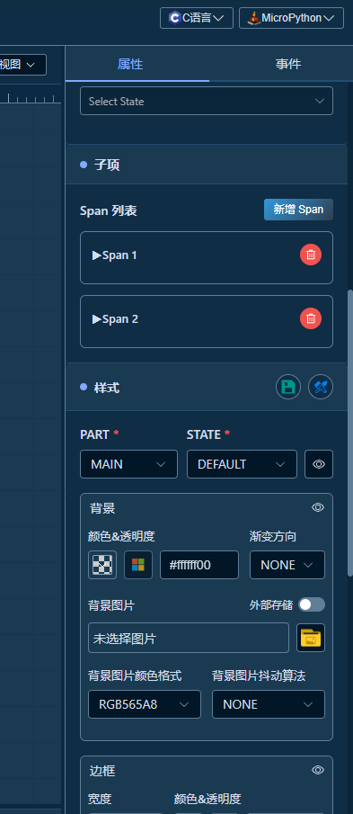
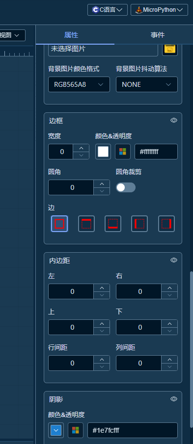
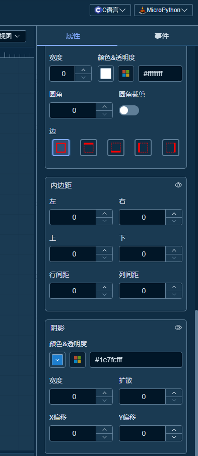
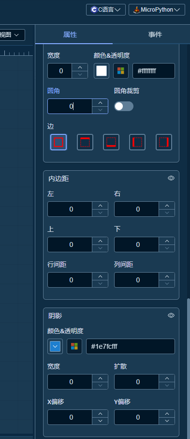


#### 专用属性

（无 `general` 分组专用字段；面板仍含 **位置信息**、**行为配置**、**样式**。）

**扩展数据（extraData，属性面板内嵌编辑器）：**

属性分组内 **Span 列表** 编辑器（非子控件树），字段如下：

| Beken 面板 | extraData 键 | 说明 |
|------------|--------------|------|
| 文本 | `spans[].text` | 该段显示文字 |
| 静态文本 | `spans[].is_text_static` | 是否编译期常量 |
| 颜色 | `spans[].text_color` | `#RRGGBBAA` |
| 字号 | `spans[].font` | 像素字号 |
| 装饰 | `spans[].text_decor` | `NONE` / `UNDERLINE` / `STRIKETHROUGH` |
| 字体 | `spans[].font_family` | 来自资源管理器的字体名 |

- `spans[]`：有序富文本段列表；`children` 必须为空。

#### 样式 Part

`main`（MAIN）

> 通用样式子组（背景、字体、边框、阴影、内边距等）见 §4.4.2；多 Part 控件请在 **PART** 下拉中分别编辑 `main` / `indicator` / `knob` 等。

### 5.5.2 表格（`table`）

**Beken 参照：** `ref/beken/.../component-specs/table/table.md`；截图 `docs/beken界面/属性面板/表格属性/表格属性-1.png`～`表格属性-6.png`、`-全窗.png`

**Beken 截图：**

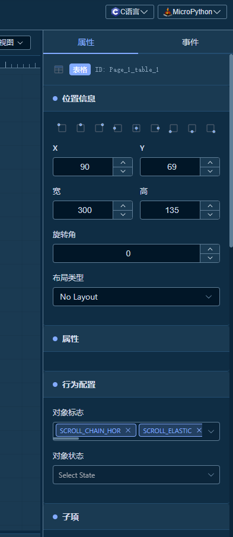
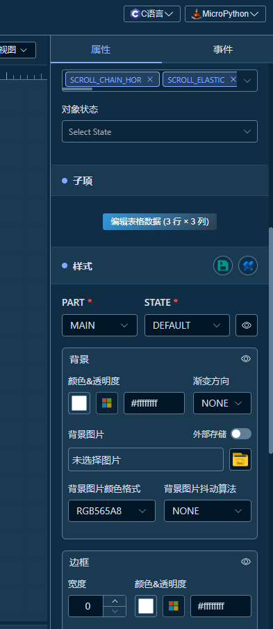
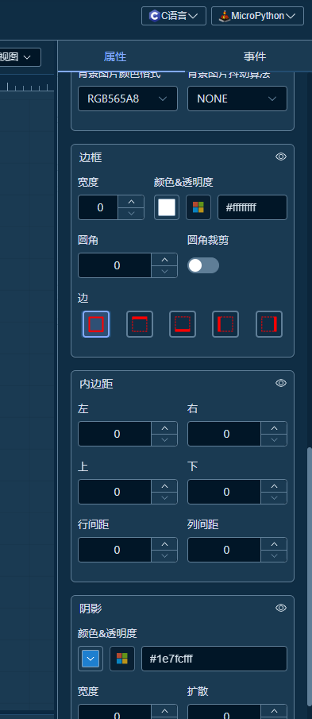

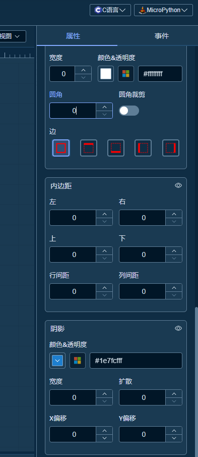


#### 专用属性

| 字段 | Beken UI | 类型 | 默认值 | ForgeUI |
|------|----------|------|--------|---------|
| `row_cnt` | 行数 | Common/Number | 3 | V1 |
| `col_cnt` | 列数 | Common/Number | 3 | V1 |

**扩展数据（extraData，属性面板内嵌编辑器）：**

- `column_widths[]`: width for each column, in column order.
- `cells[]`: table cell values.
- `cells[].row`: zero-based row index.
- `cells[].col`: zero-based column index.
- `cells[].value`: visible cell text.

#### 样式 Part

`main`（MAIN）、`items`（ITEMS）

> 通用样式子组（背景、字体、边框、阴影、内边距等）见 §4.4.2；多 Part 控件请在 **PART** 下拉中分别编辑 `main` / `indicator` / `knob` 等。

### 5.5.3 列表（`list`）

**Beken 参照：** `ref/beken/.../component-specs/list/list.md`；截图 `docs/beken界面/属性面板/列表属性/列表属性-1.png`～`列表属性-6.png`、`-全窗.png`

**Beken 截图：**

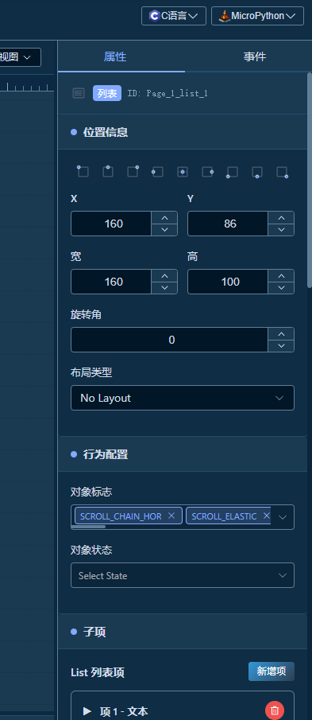
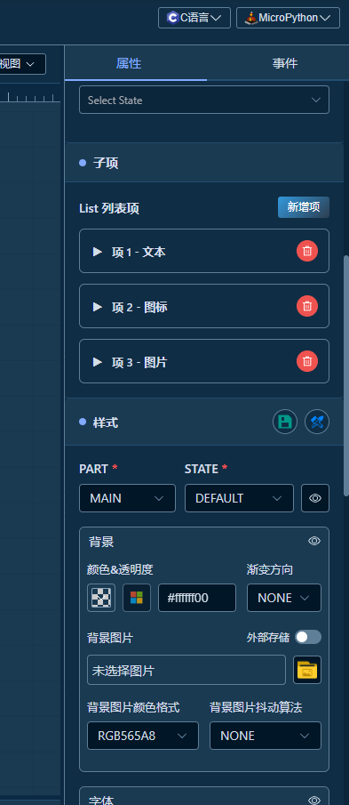
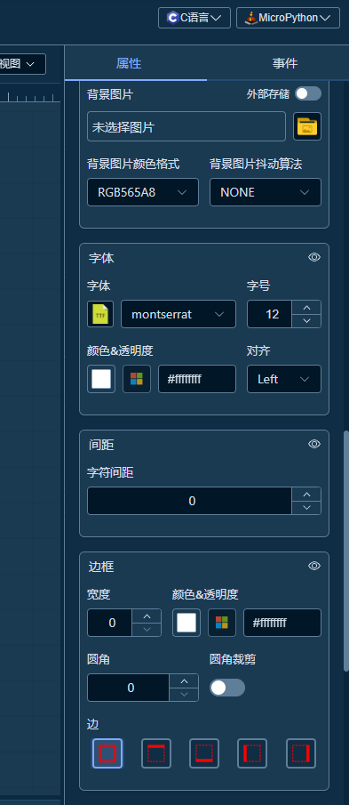
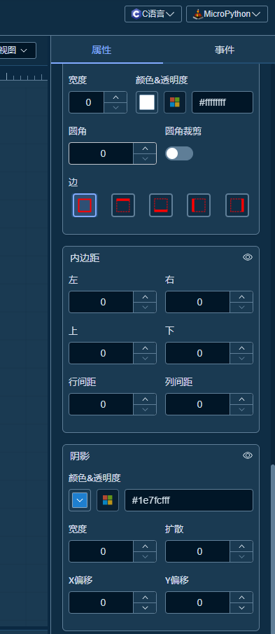

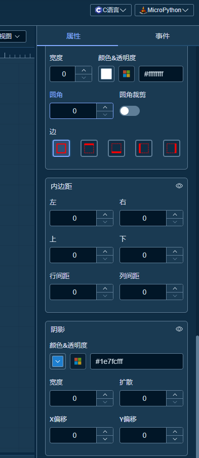

#### 专用属性

（无 `general` 分组专用字段；面板仍含 **位置信息**、**行为配置**、**样式**。）

**扩展数据（extraData，属性面板内嵌编辑器）：**

- `items[]`: list rows.
- `items[].type`: `"text"`, `"symbol"`, or `"image"`.
- `items[].text`: row label.
- `items[].text_i18nEnabled`: optional i18n flag.
- `items[].is_text_static`: optional static-text flag.
- `items[].img_symbol`: built-in LVGL symbol short name when `type` is `"symbol"`. Must be one of `allowedLvglSymbols` from `get_component_type_spec` (see `lvgl-symbols.md`). Do not invent names such as `USER`.

#### 样式 Part

`main`（MAIN）、`main_button`（BUTTON）、`main_item`（ITEM TEXT）、`scrollbar`（SCROLLBAR）

> 通用样式子组（背景、字体、边框、阴影、内边距等）见 §4.4.2；多 Part 控件请在 **PART** 下拉中分别编辑 `main` / `indicator` / `knob` 等。

### 5.6 按钮类
### 5.6.1 图片按钮（`imagebutton`）

**Beken 参照：** `ref/beken/.../component-specs/imagebutton/imagebutton.md`；截图 `docs/beken界面/属性面板/图片按钮属性/图片按钮属性-1.png`～`图片按钮属性-6.png`、`-全窗.png`

**Beken 截图：**

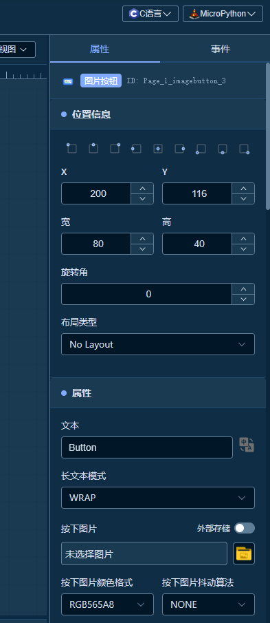
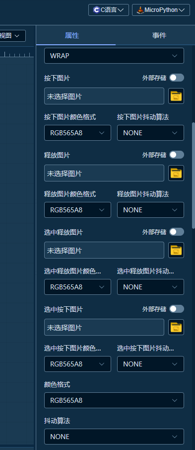
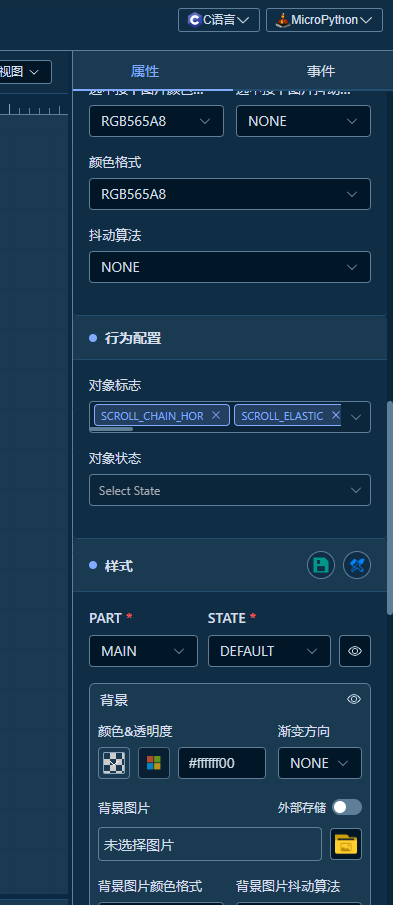
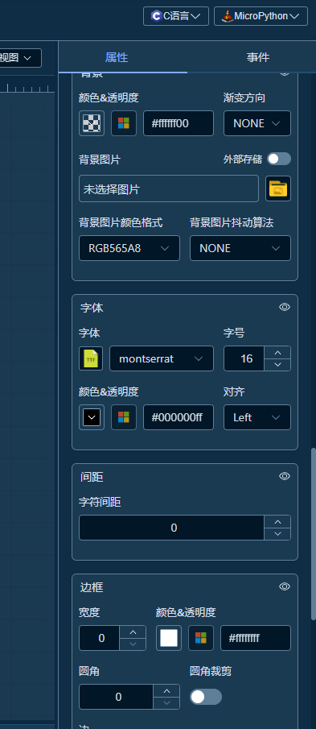
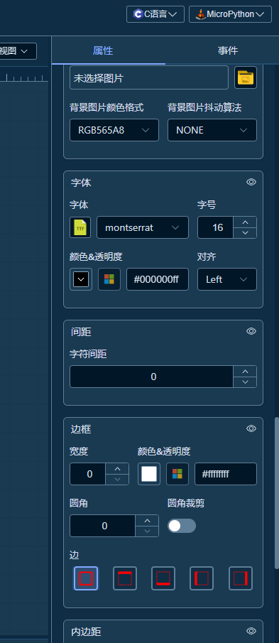
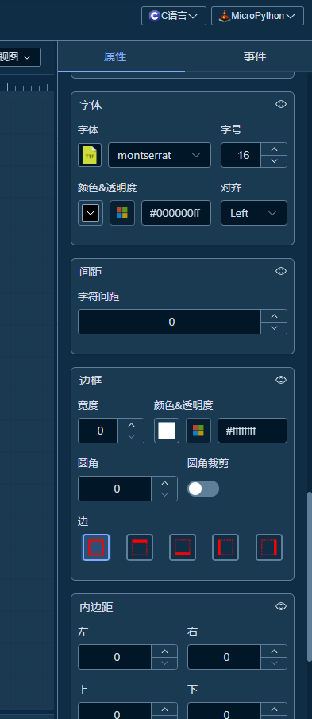

#### 专用属性

| 字段 | Beken UI | 类型 | 默认值 | ForgeUI |
|------|----------|------|--------|---------|
| `text` | 文本 | Common/String | "Button" | `props.text` |
| `src_pressed` | src_pressed | LVGL/ImageSrc | "" | V1 |
| `src_released` | src_released | LVGL/ImageSrc | "" | V1 |
| `src_checked_released` | src_checked_released | LVGL/ImageSrc | "" | V1 |
| `src_checked_pressed` | src_checked_pressed | LVGL/ImageSrc | "" | V1 |
| `long_mode` | 长文本模式 | Common/Enum | "WRAP" | V1 |

#### 样式 Part

`main`（MAIN）

> 通用样式子组（背景、字体、边框、阴影、内边距等）见 §4.4.2；多 Part 控件请在 **PART** 下拉中分别编辑 `main` / `indicator` / `knob` 等。

### 5.6.2 按钮矩阵（`buttonmatrix`）

**Beken 参照：** `ref/beken/.../component-specs/buttonmatrix/buttonmatrix.md`；截图 `docs/beken界面/属性面板/按钮矩阵属性/按钮矩阵属性-1.png`～`按钮矩阵属性-6.png`、`-全窗.png`

**Beken 截图：**

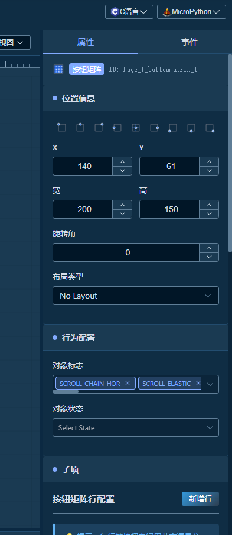
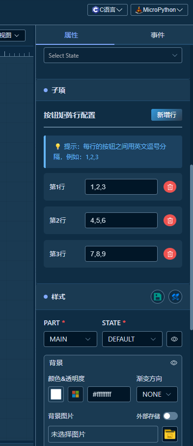
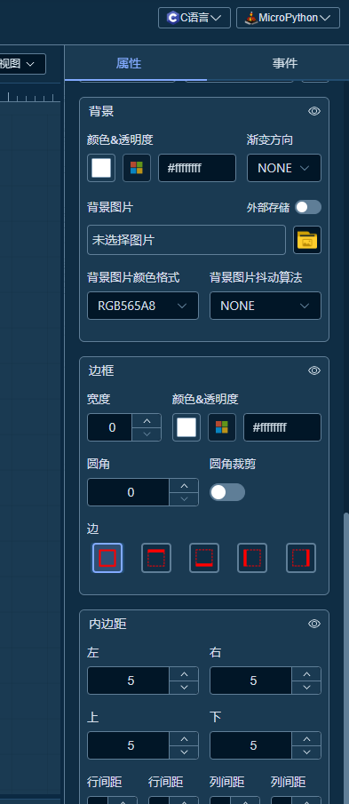
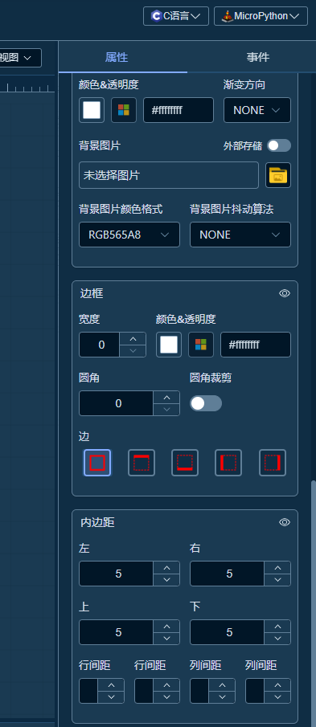


#### 专用属性

（无 `general` 分组专用字段；面板仍含 **位置信息**、**行为配置**、**样式**。）

**扩展数据（extraData，属性面板内嵌编辑器）：**

- `text_map[]`: ordered button labels. Use `"\n"` as a row break and end the array with an empty string `""`.
- `one_checked`: when true, one matrix item can stay checked.

#### 样式 Part

`main`（MAIN）、`items`（ITEMS）

> 通用样式子组（背景、字体、边框、阴影、内边距等）见 §4.4.2；多 Part 控件请在 **PART** 下拉中分别编辑 `main` / `indicator` / `knob` 等。

### 5.7 表单输入类
### 5.7.1 文本域（`textarea`）

**Beken 参照：** `ref/beken/.../component-specs/textarea/textarea.md`；截图 `docs/beken界面/属性面板/文本域属性/文本域属性-1.png`～`文本域属性-6.png`、`-全窗.png`

**Beken 截图：**

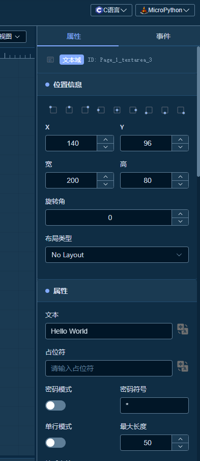
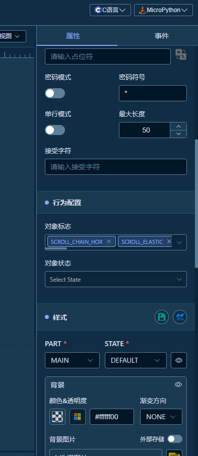
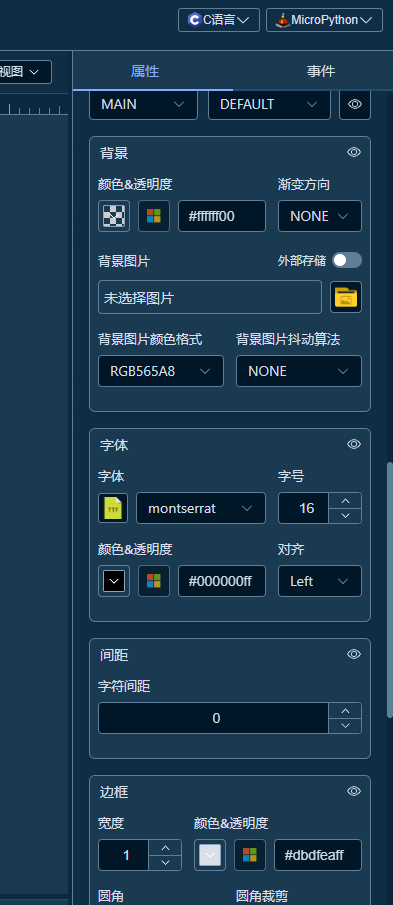
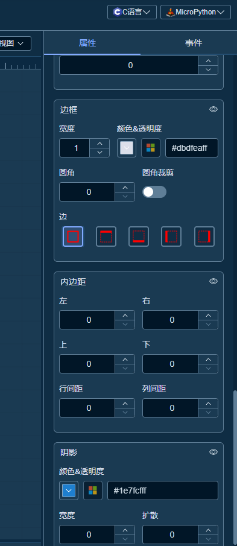

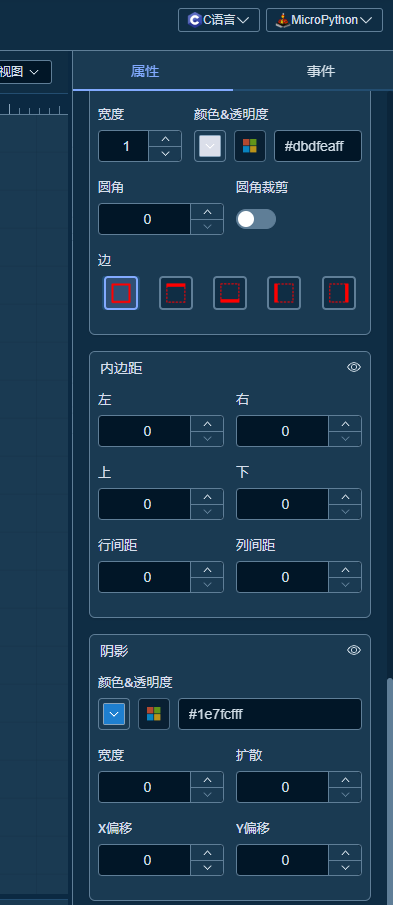

#### 专用属性

| 字段 | Beken UI | 类型 | 默认值 | ForgeUI |
|------|----------|------|--------|---------|
| `text` | 文本 | Common/String | "Hello World" | `props.text` |
| `placeholder` | 占位符 | Common/String | "" | V1 |
| `password_mode` | 密码模式 | Common/Boolean | false | V1 |
| `password_bullet` | password_bullet | Common/String | "*" | V1 |
| `one_line_mode` | one_line_mode | Common/Boolean | false | V1 |
| `accept_characters` | accept_characters | Common/String | "" | V1 |
| `max_len` | max_len | Common/Number | 50 | V1 |

#### 样式 Part

`main`（MAIN）、`scrollbar`（SCROLLBAR）

> 通用样式子组（背景、字体、边框、阴影、内边距等）见 §4.4.2；多 Part 控件请在 **PART** 下拉中分别编辑 `main` / `indicator` / `knob` 等。

### 5.7.2 复选框（`checkbox`）

**Beken 参照：** `ref/beken/.../component-specs/checkbox/checkbox.md`；截图 `docs/beken界面/属性面板/复选框属性/复选框属性-1.png`～`复选框属性-6.png`、`-全窗.png`

**Beken 截图：**

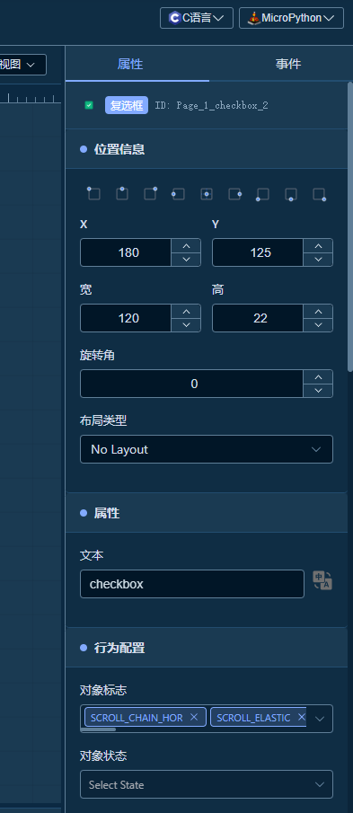
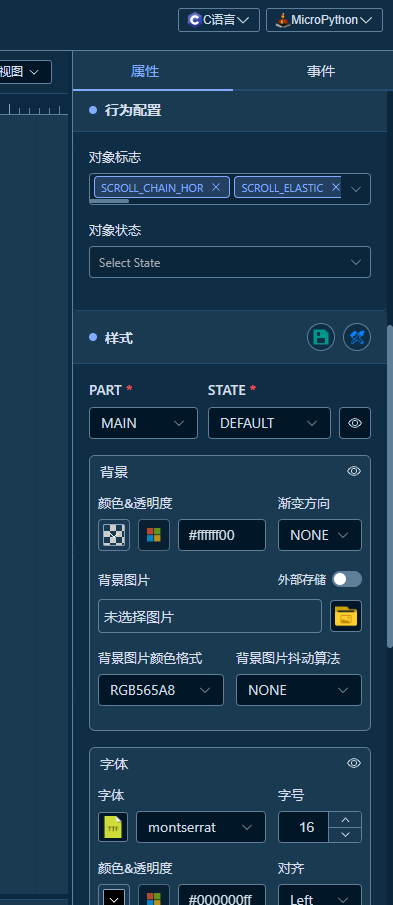
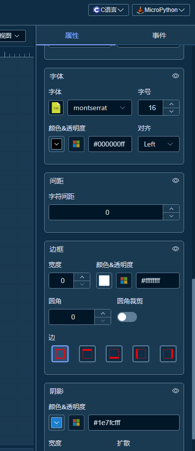
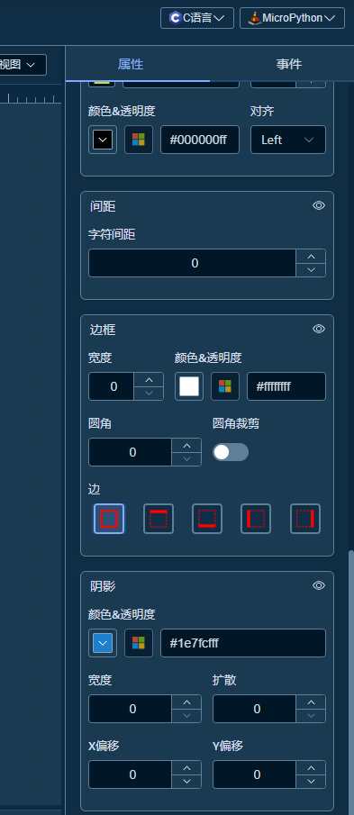


#### 专用属性

| 字段 | Beken UI | 类型 | 默认值 | ForgeUI |
|------|----------|------|--------|---------|
| `text` | 文本 | Common/String | "checkbox" | `props.text` |

#### 样式 Part

`main`（MAIN）、`indicator`（INDICATOR）

> 通用样式子组（背景、字体、边框、阴影、内边距等）见 §4.4.2；多 Part 控件请在 **PART** 下拉中分别编辑 `main` / `indicator` / `knob` 等。

### 5.7.3 开关（`switch`）

**Beken 参照：** `ref/beken/.../component-specs/switch/switch.md`；截图 `docs/beken界面/属性面板/开关属性/开关属性-1.png`～`开关属性-6.png`、`-全窗.png`

**Beken 截图：**

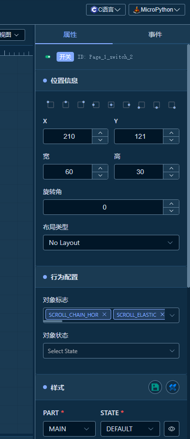
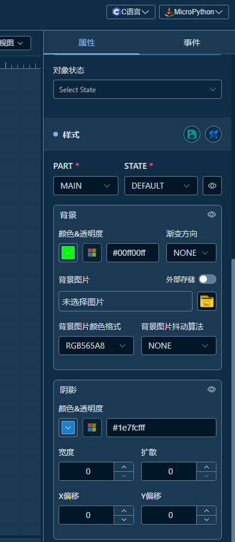
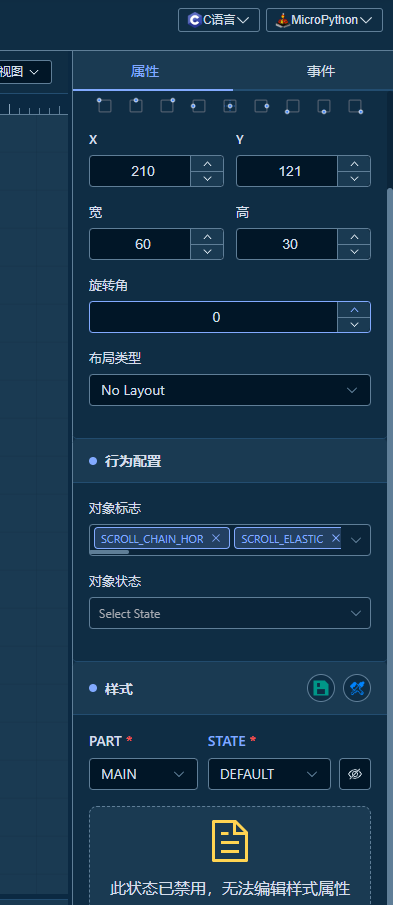
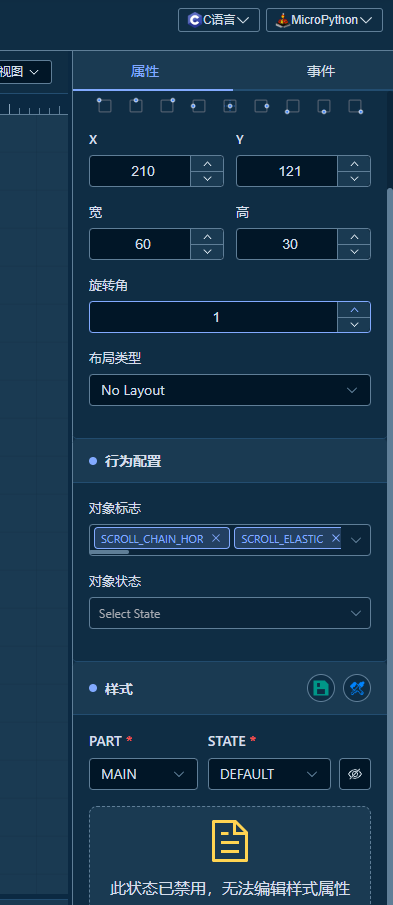


#### 专用属性

（无 `general` 分组专用字段；面板仍含 **位置信息**、**行为配置**、**样式**。）

#### 样式 Part

`main`（MAIN）、`indicator`（INDICATOR）、`knob`（KNOB）

> 通用样式子组（背景、字体、边框、阴影、内边距等）见 §4.4.2；多 Part 控件请在 **PART** 下拉中分别编辑 `main` / `indicator` / `knob` 等。

### 5.7.4 滑块（`slider`）

**Beken 参照：** `ref/beken/.../component-specs/slider/slider.md`；截图 `docs/beken界面/属性面板/滑块属性/滑块属性-1.png`～`滑块属性-6.png`、`-全窗.png`

**Beken 截图：**

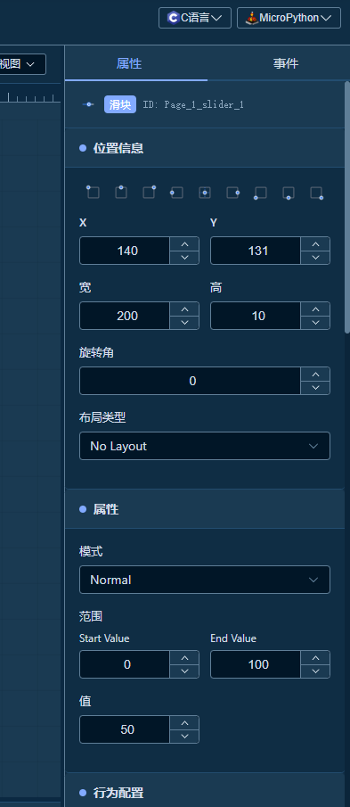
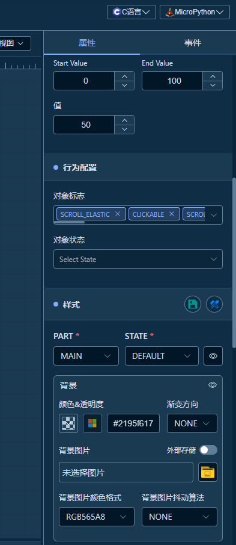
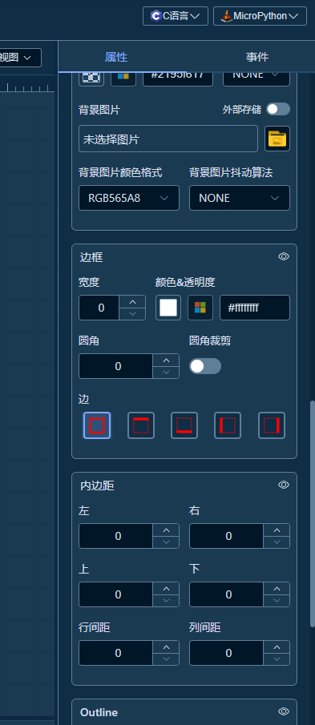
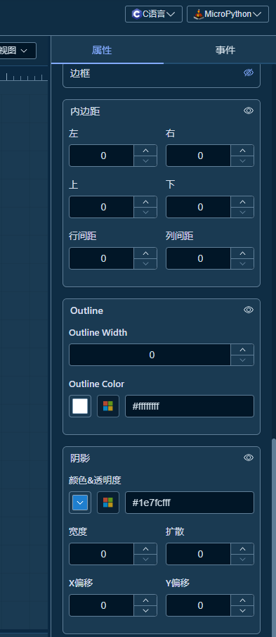

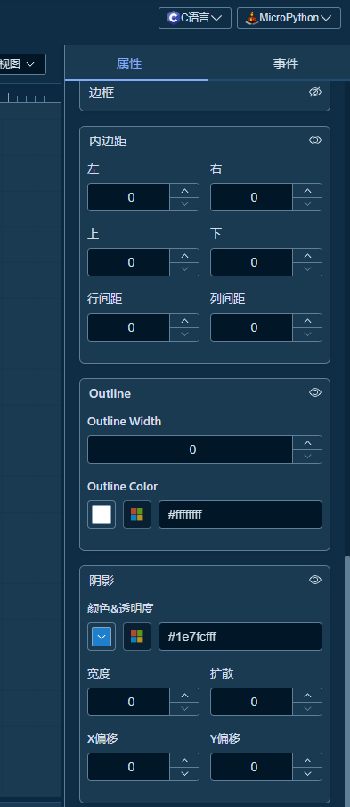

#### 专用属性

| 字段 | Beken UI | 类型 | 默认值 | ForgeUI |
|------|----------|------|--------|---------|
| `range` | 范围 | Common/Range | {"min":0,"max":100} | V1 |
| `value` | 当前值 | Common/Number | 50 | `props.value` |
| `start_value` | start_value | Common/Number | 0 | V1 |
| `mode` | 模式 | Common/Enum | "Normal" | V1 |

#### 样式 Part

`main`（MAIN）、`indicator`（INDICATOR）、`knob`（KNOB）

> 通用样式子组（背景、字体、边框、阴影、内边距等）见 §4.4.2；多 Part 控件请在 **PART** 下拉中分别编辑 `main` / `indicator` / `knob` 等。

### 5.7.5 下拉菜单（`dropdown`）

**Beken 参照：** `ref/beken/.../component-specs/dropdown/dropdown.md`；截图 `docs/beken界面/属性面板/下拉菜单属性/下拉菜单属性-1.png`～`下拉菜单属性-4.png`、`-全窗.png`

**Beken 截图：**

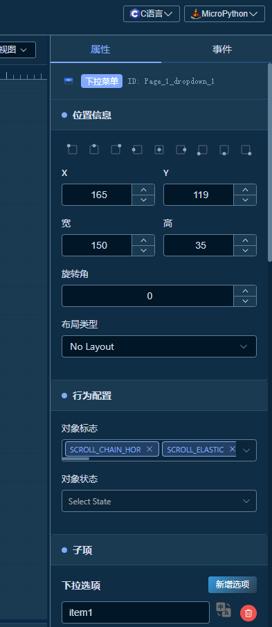
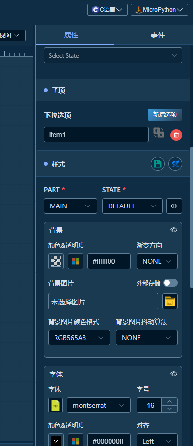
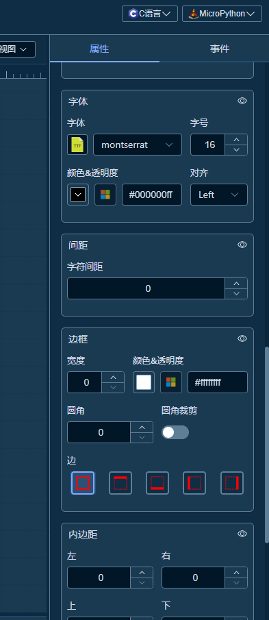


#### 专用属性

（无 `general` 分组专用字段；面板仍含 **位置信息**、**行为配置**、**样式**。）

**扩展数据（extraData，属性面板内嵌编辑器）：**

- `items[]`: option list in display order.
- `items[].text`: option text.
- `items[].text_i18nEnabled`: optional i18n flag.
- `items[].is_text_static`: optional static-text flag.

#### 样式 Part

`main`（MAIN）、`main_list`（ITEM）、`selected_list`（SELECTED ITEM）、`scrollbar_list`（SCROLLBAR）

> 通用样式子组（背景、字体、边框、阴影、内边距等）见 §4.4.2；多 Part 控件请在 **PART** 下拉中分别编辑 `main` / `indicator` / `knob` 等。

### 5.7.6 滚轮（`roller`）

**Beken 参照：** `ref/beken/.../component-specs/roller/roller.md`；截图 `docs/beken界面/属性面板/滚轮属性/滚轮属性-1.png`～`滚轮属性-5.png`、`-全窗.png`

**Beken 截图：**

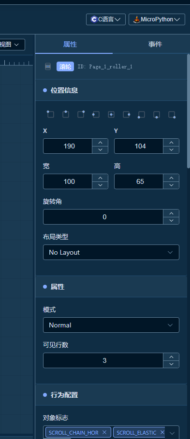
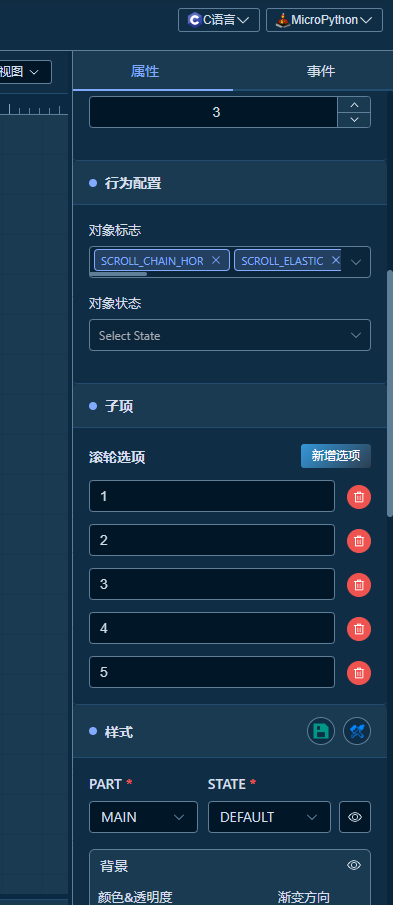
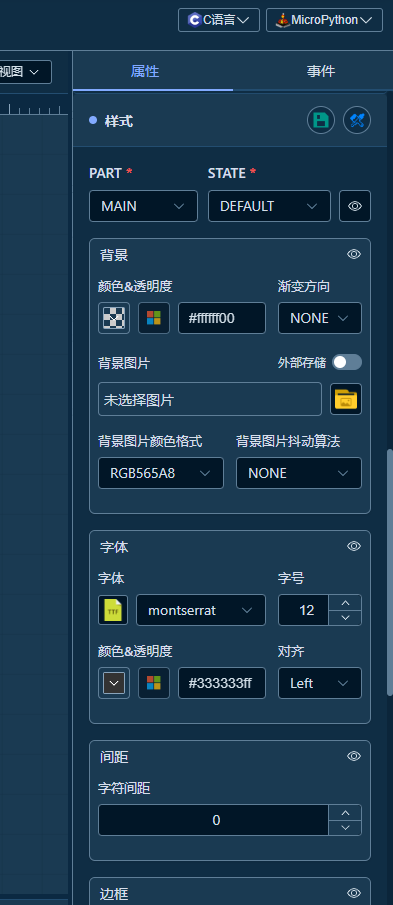
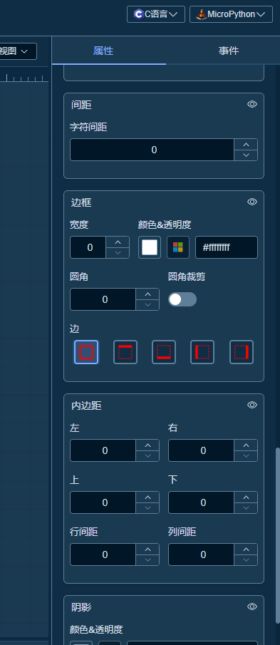


#### 专用属性

| 字段 | Beken UI | 类型 | 默认值 | ForgeUI |
|------|----------|------|--------|---------|
| `visible_row_count` | visible_row_count | Common/Number | 3 | V1 |
| `mode` | 模式 | Common/Enum | "NORMAL" | V1 |

**扩展数据（extraData，属性面板内嵌编辑器）：**

- `items[]`: option strings in display order.

#### 样式 Part

`main`（MAIN）、`selected`（SELECTED）

> 通用样式子组（背景、字体、边框、阴影、内边距等）见 §4.4.2；多 Part 控件请在 **PART** 下拉中分别编辑 `main` / `indicator` / `knob` 等。

### 5.7.7 数字输入框（`spinbox`）

**Beken 参照：** `ref/beken/.../component-specs/spinbox/spinbox.md`；截图 `docs/beken界面/属性面板/数字输入框属性/数字输入框属性-1.png`～`数字输入框属性-4.png`、`-全窗.png`

**Beken 截图：**

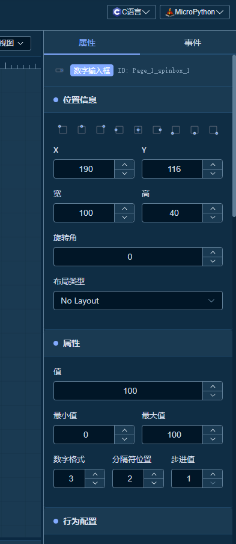
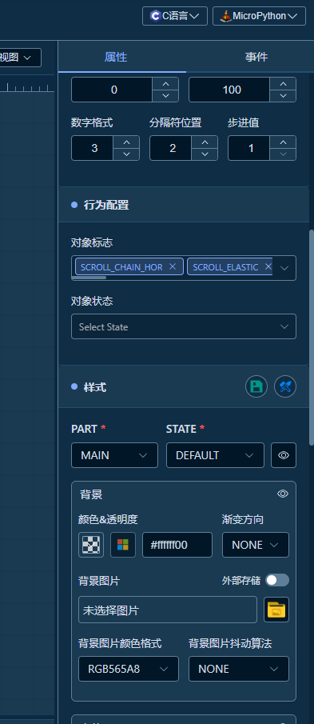
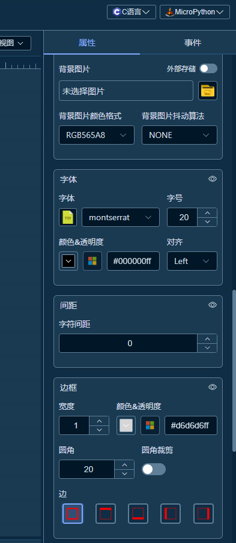
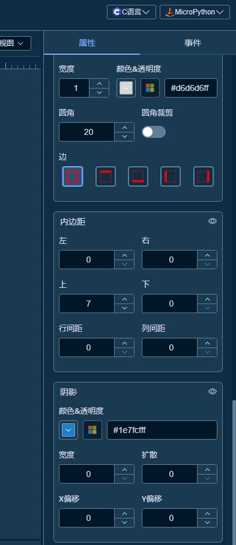

#### 专用属性

| 字段 | Beken UI | 类型 | 默认值 | ForgeUI |
|------|----------|------|--------|---------|
| `value` | 当前值 | Common/Number | 100 | `props.value` |
| `range_min` | 最小值 | Common/Number | 0 | V1 |
| `range_max` | 最大值 | Common/Number | 100 | V1 |
| `digit_format` | digit_format | Common/Number | 3 | V1 |
| `separator_position` | separator_position | Common/Number | 2 | V1 |
| `step` | step | Common/Number | 1 | V1 |

#### 样式 Part

`main`（MAIN）、`cursor`（CURSOR）

> 通用样式子组（背景、字体、边框、阴影、内边距等）见 §4.4.2；多 Part 控件请在 **PART** 下拉中分别编辑 `main` / `indicator` / `knob` 等。

### 5.8 图片媒体类
### 5.8.1 动画图片（`animimg`）

**Beken 参照：** `ref/beken/.../component-specs/animimg/animimg.md`；截图 `docs/beken界面/属性面板/动画图片属性/动画图片属性-1.png`～`动画图片属性-6.png`、`-全窗.png`

**Beken 截图：**

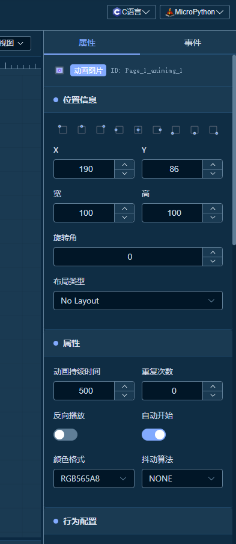
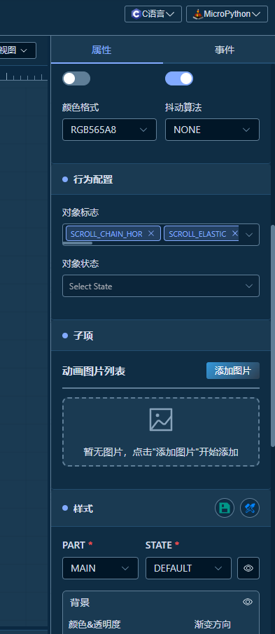
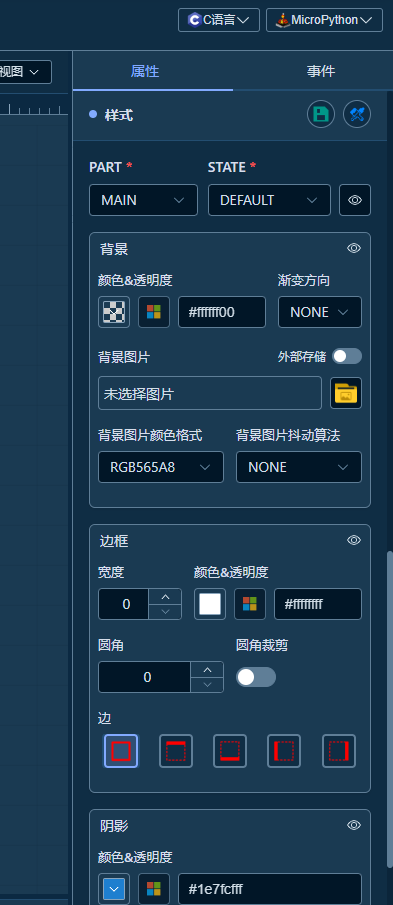
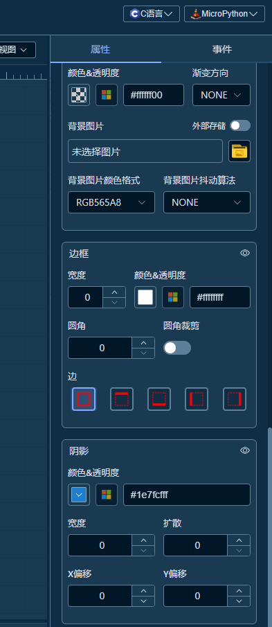


#### 专用属性

| 字段 | Beken UI | 类型 | 默认值 | ForgeUI |
|------|----------|------|--------|---------|
| `duration` | duration | Common/Number | 500 | V1 |
| `reverse` | reverse | Common/Boolean | false | V1 |
| `reverse_delay` | reverse_delay | Common/Number | 200 | V1 |
| `reverse_duration` | reverse_duration | Common/Number | 500 | V1 |
| `repeat_count` | repeat_count | Common/Number | 0 | V1 |
| `autostart` | autostart | Common/Boolean | true | V1 |

**扩展数据（extraData，属性面板内嵌编辑器）：**

- `images[]`: ordered asset objects for animation frames. Use the same asset object shape already present in project data, typically including fields such as `name`, `path`, `width`, and `height`.

#### 样式 Part

`main`（MAIN）

> 通用样式子组（背景、字体、边框、阴影、内边距等）见 §4.4.2；多 Part 控件请在 **PART** 下拉中分别编辑 `main` / `indicator` / `knob` 等。

### 5.8.2 画布（`canvas`）

**Beken 参照：** `ref/beken/.../component-specs/canvas/canvas.md`；截图 `docs/beken界面/属性面板/画布属性/画布属性-1.png`～`画布属性-6.png`、`-全窗.png`

**Beken 截图：**

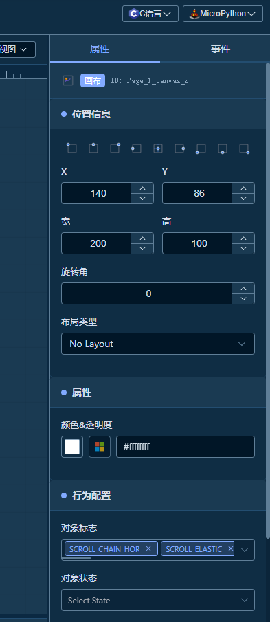
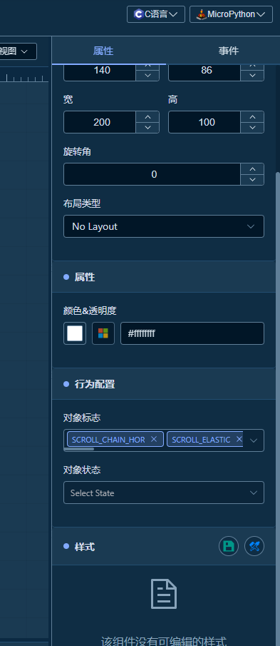


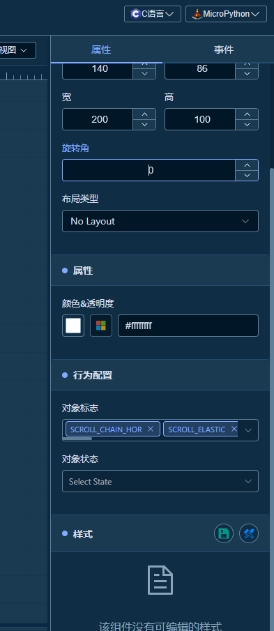


#### 专用属性

| 字段 | Beken UI | 类型 | 默认值 | ForgeUI |
|------|----------|------|--------|---------|
| `bg_color` | bg_color | LVGL/Color | "#ffffffff" | V1 |
| `bg_opa` | bg_opa | Common/Number | 255 | V1 |

#### 样式 Part

`main`（MAIN）

> 通用样式子组（背景、字体、边框、阴影、内边距等）见 §4.4.2；多 Part 控件请在 **PART** 下拉中分别编辑 `main` / `indicator` / `knob` 等。

### 5.9 可视化类
### 5.9.1 圆弧（`arc`）

**Beken 参照：** `ref/beken/.../component-specs/arc/arc.md`；截图 `docs/beken界面/属性面板/圆弧属性/圆弧属性-1.png`～`圆弧属性-5.png`、`-全窗.png`

**Beken 截图：**

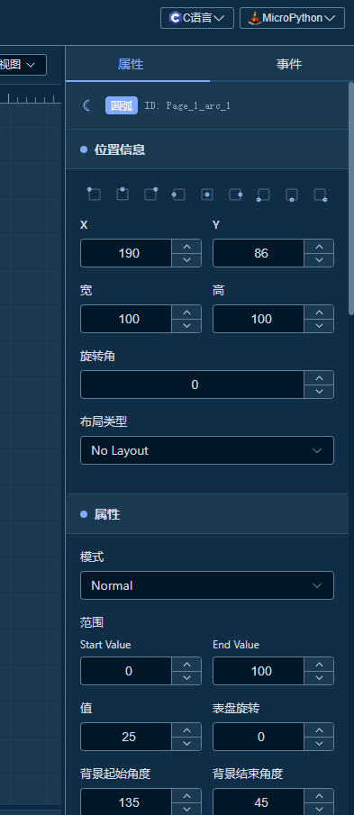
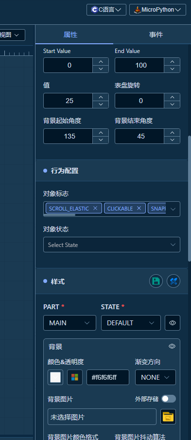
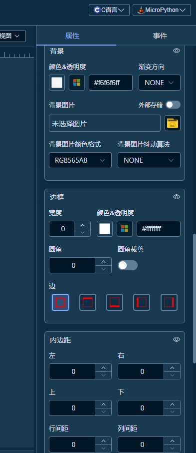
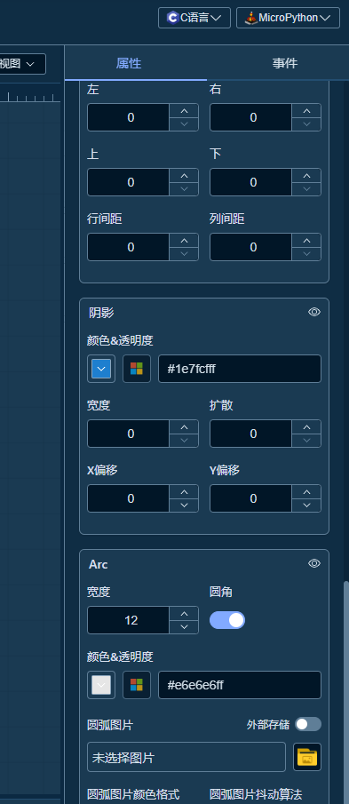
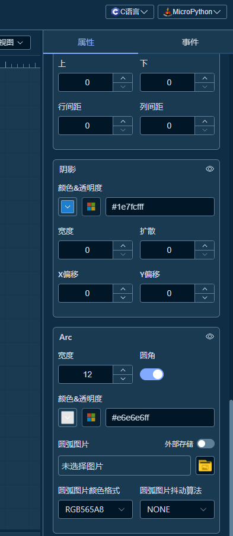

#### 专用属性

| 字段 | Beken UI | 类型 | 默认值 | ForgeUI |
|------|----------|------|--------|---------|
| `range` | 范围 | Common/Range | {"min":0,"max":100} | V1 |
| `value` | 当前值 | Common/Number | 25 | `props.value` |
| `bg_start_angle` | bg_start_angle | Common/Number | 135 | V1 |
| `bg_end_angle` | bg_end_angle | Common/Number | 45 | V1 |
| `rotation` | rotation | Common/Number | 0 | V1 |
| `change_rate` | change_rate | Common/Number | 720 | V1 |
| `mode` | 模式 | Common/Enum | "NORMAL" | V1 |

#### 样式 Part

`main`（MAIN）、`indicator`（INDICATOR）、`knob`（KNOB）

> 通用样式子组（背景、字体、边框、阴影、内边距等）见 §4.4.2；多 Part 控件请在 **PART** 下拉中分别编辑 `main` / `indicator` / `knob` 等。

### 5.9.2 线条（`line`）

**Beken 参照：** `ref/beken/.../component-specs/line/line.md`；截图 `docs/beken界面/属性面板/线条属性/线条属性-1.png`～`线条属性-3.png`、`-全窗.png`

**Beken 截图：**

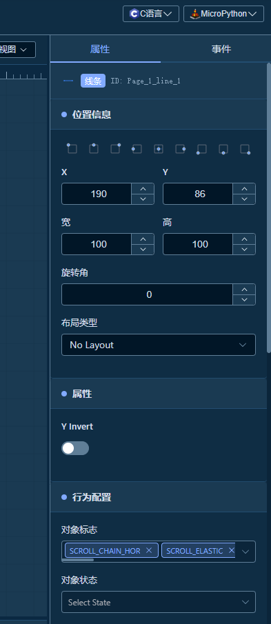
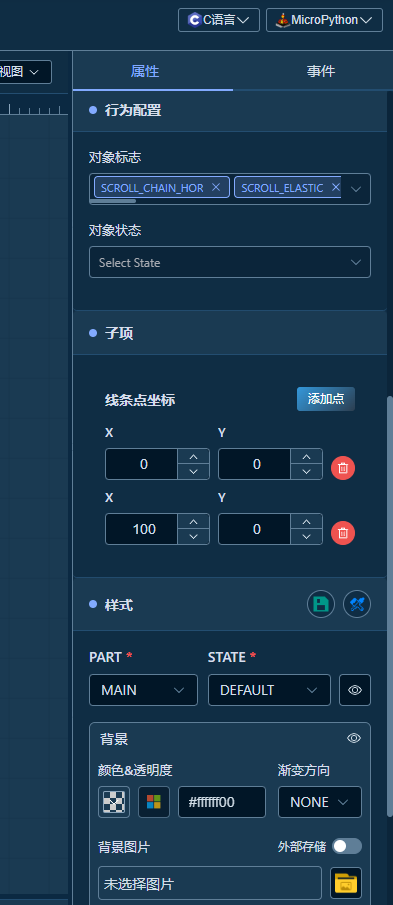
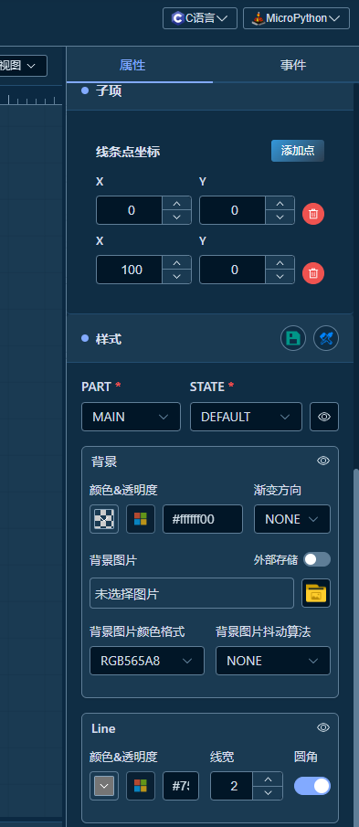

#### 专用属性

| 字段 | Beken UI | 类型 | 默认值 | ForgeUI |
|------|----------|------|--------|---------|
| `y_invert` | y_invert | Common/Boolean | false | V1 |

**扩展数据（extraData，属性面板内嵌编辑器）：**

- `points[]`: ordered point array, where each point is `[x, y]` relative to the line component.

#### 样式 Part

`main`（MAIN）

> 通用样式子组（背景、字体、边框、阴影、内边距等）见 §4.4.2；多 Part 控件请在 **PART** 下拉中分别编辑 `main` / `indicator` / `knob` 等。

### 5.9.3 二维码（`qrcode`）

**Beken 参照：** `ref/beken/.../component-specs/qrcode/qrcode.md`；截图 `docs/beken界面/属性面板/二维码属性/二维码属性-1.png`～`二维码属性-4.png`、`-全窗.png`

**Beken 截图：**


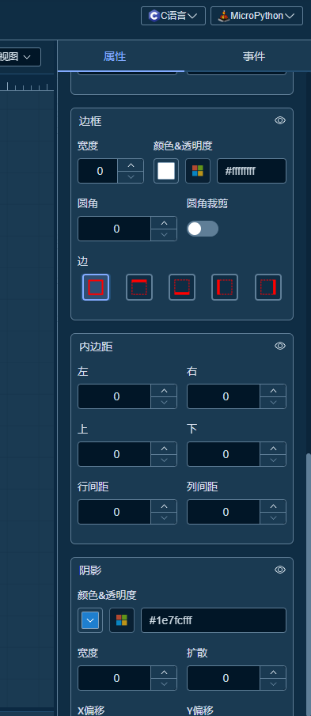


#### 专用属性

| 字段 | Beken UI | 类型 | 默认值 | ForgeUI |
|------|----------|------|--------|---------|
| `qr_size` | qr_size | Common/Number | 100 | V1 |
| `qr_data` | qr_data | Common/String | "https://www.bekencorp.com" | V1 |
| `dark_color` | dark_color | LVGL/Color | "#2C3224ff" | V1 |
| `light_color` | light_color | LVGL/Color | "#ffffffff" | V1 |

#### 样式 Part

`main`（MAIN）

> 通用样式子组（背景、字体、边框、阴影、内边距等）见 §4.4.2；多 Part 控件请在 **PART** 下拉中分别编辑 `main` / `indicator` / `knob` 等。

### 5.9.4 条形码（`barcode`）

**Beken 参照：** `ref/beken/.../component-specs/barcode/barcode.md`；截图 `docs/beken界面/属性面板/条形码属性/条形码属性-1.png`～`条形码属性-5.png`、`-全窗.png`

**Beken 截图：**

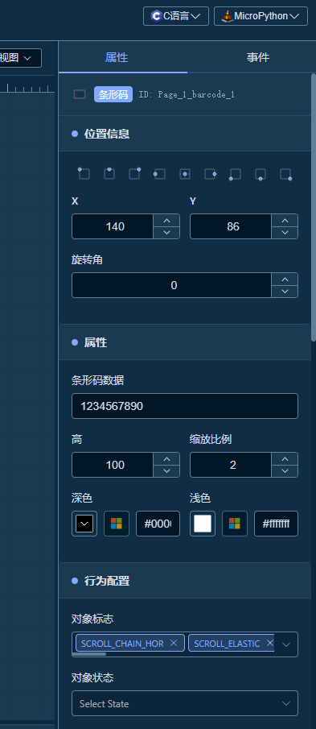
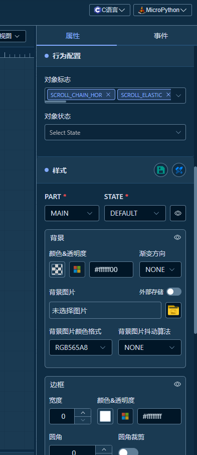

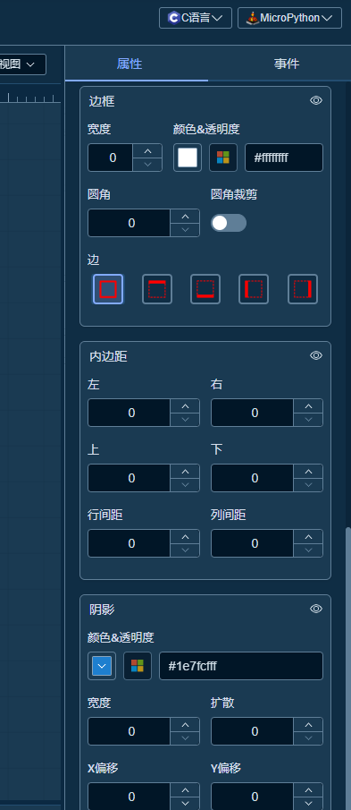


#### 专用属性

| 字段 | Beken UI | 类型 | 默认值 | ForgeUI |
|------|----------|------|--------|---------|
| `rotation` | rotation | Common/Number | 0 | V1 |
| `barcode_data` | barcode_data | Common/String | "1234567890" | V1 |
| `scale` | scale | Common/Number | 2 | V1 |
| `dark_color` | dark_color | LVGL/Color | "#000000ff" | V1 |
| `light_color` | light_color | LVGL/Color | "#ffffffff" | V1 |

#### 样式 Part

`main`（MAIN）

> 通用样式子组（背景、字体、边框、阴影、内边距等）见 §4.4.2；多 Part 控件请在 **PART** 下拉中分别编辑 `main` / `indicator` / `knob` 等。

### 5.9.5 LED（`led`）

**Beken 参照：** `ref/beken/.../component-specs/led/led.md`；截图 `docs/beken界面/属性面板/LED属性/LED属性-1.png`～`LED属性-3.png`、`-全窗.png`

**Beken 截图：**

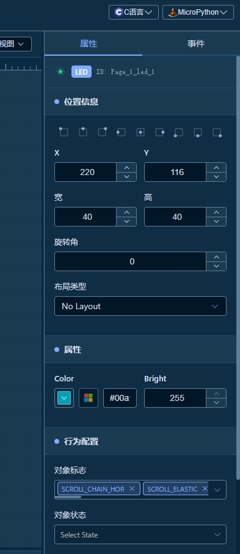
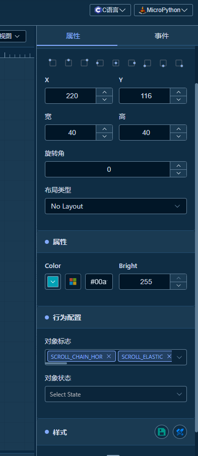
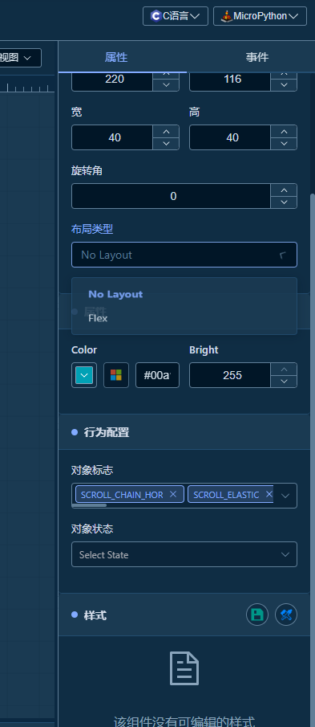

#### 专用属性

| 字段 | Beken UI | 类型 | 默认值 | ForgeUI |
|------|----------|------|--------|---------|
| `bright` | bright | Common/Number | 255 | V1 |
| `color` | color | LVGL/Color | "#00a1b5ff" | V1 |

#### 样式 Part

`main`（MAIN）

> 通用样式子组（背景、字体、边框、阴影、内边距等）见 §4.4.2；多 Part 控件请在 **PART** 下拉中分别编辑 `main` / `indicator` / `knob` 等。

### 5.10 反馈类
### 5.10.1 进度条（`bar`）

**Beken 参照：** `ref/beken/.../component-specs/bar/bar.md`；截图 `docs/beken界面/属性面板/进度条属性/进度条属性-1.png`～`进度条属性-5.png`、`-全窗.png`

**Beken 截图：**

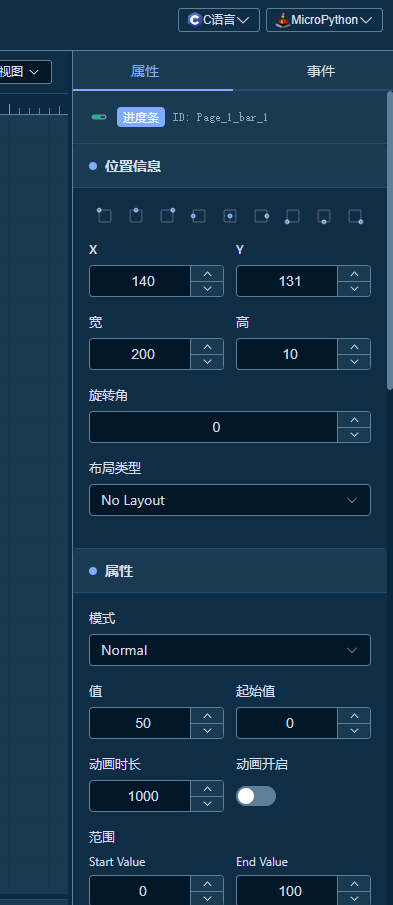
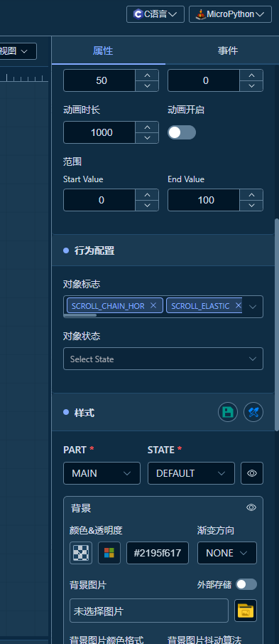
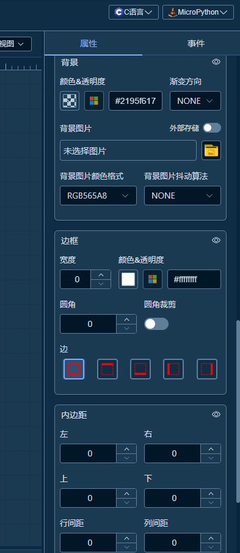
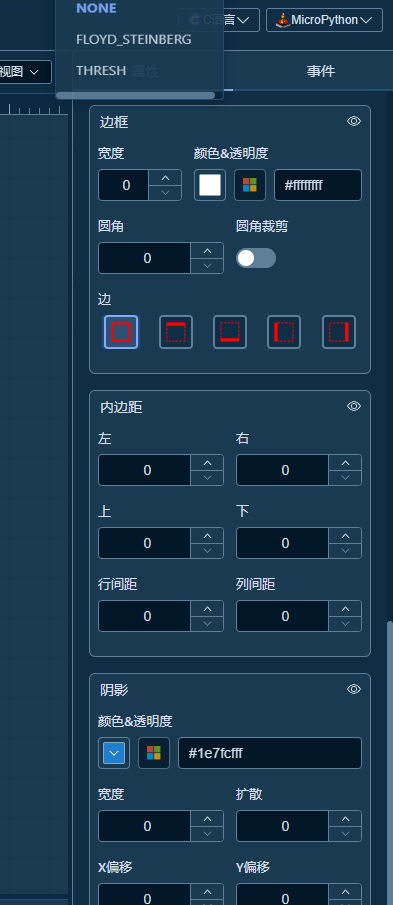


#### 专用属性

| 字段 | Beken UI | 类型 | 默认值 | ForgeUI |
|------|----------|------|--------|---------|
| `range` | 范围 | Common/Range | {"min":0,"max":100} | V1 |
| `value` | 当前值 | Common/Number | 50 | `props.value` |
| `start_value` | start_value | Common/Number | 0 | V1 |
| `anim_duration` | anim_duration | Common/Number | 1000 | V1 |
| `anim_on` | anim_on | Common/Boolean | false | V1 |
| `mode` | 模式 | Common/Enum | "Normal" | V1 |

#### 样式 Part

`main`（MAIN）、`indicator`（INDICATOR）

> 通用样式子组（背景、字体、边框、阴影、内边距等）见 §4.4.2；多 Part 控件请在 **PART** 下拉中分别编辑 `main` / `indicator` / `knob` 等。

### 5.10.2 加载动画（`spinner`）

**Beken 参照：** `ref/beken/.../component-specs/spinner/spinner.md`；截图 `docs/beken界面/属性面板/加载动画属性/加载动画属性-1.png`～`加载动画属性-3.png`、`-全窗.png`

**Beken 截图：**

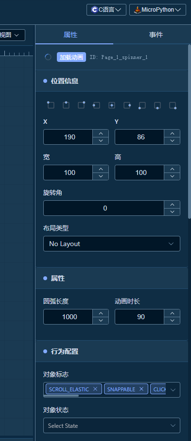
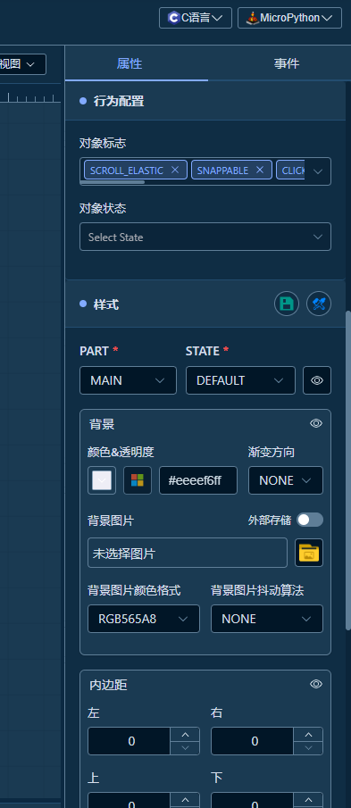
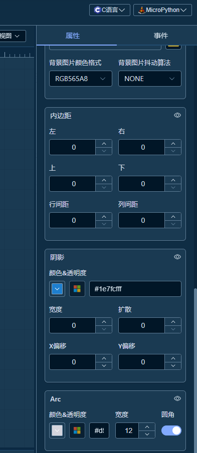

#### 专用属性

| 字段 | Beken UI | 类型 | 默认值 | ForgeUI |
|------|----------|------|--------|---------|
| `arc_length` | arc_length | Common/Number | 1000 | V1 |
| `anim_time` | anim_time | Common/Number | 90 | V1 |

#### 样式 Part

`main`（MAIN）、`indicator`（INDICATOR）

> 通用样式子组（背景、字体、边框、阴影、内边距等）见 §4.4.2；多 Part 控件请在 **PART** 下拉中分别编辑 `main` / `indicator` / `knob` 等。

### 5.10.3 消息框（`msgbox`）

**Beken 参照：** `ref/beken/.../component-specs/msgbox/msgbox.md`；截图 `docs/beken界面/属性面板/消息框属性/消息框属性-1.png`～`消息框属性-5.png`、`-全窗.png`

**Beken 截图：**

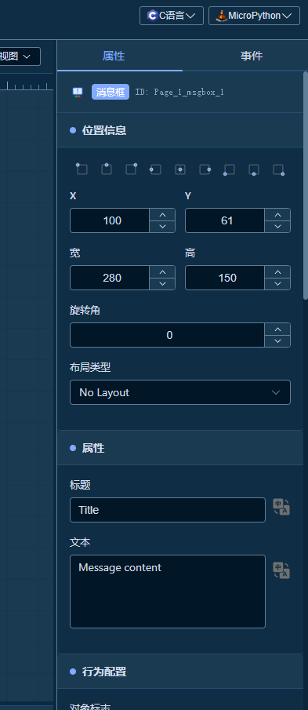
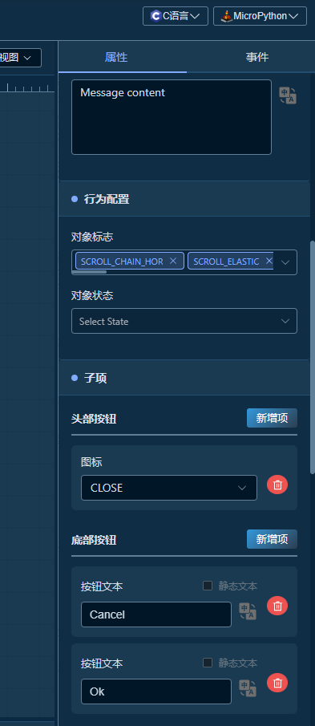
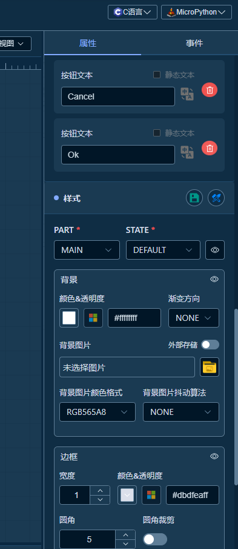
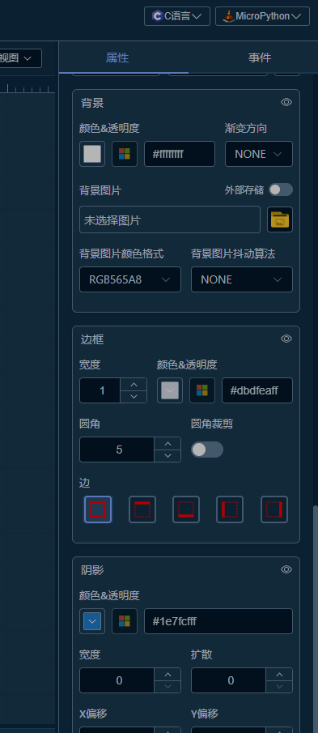
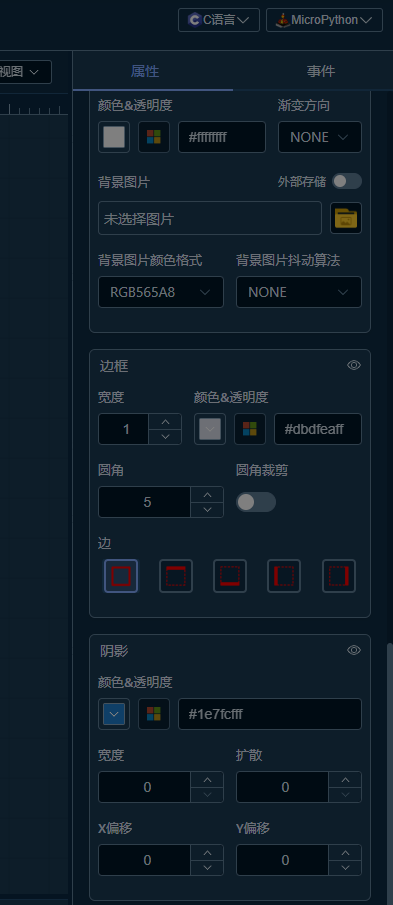

#### 专用属性

| 字段 | Beken UI | 类型 | 默认值 | ForgeUI |
|------|----------|------|--------|---------|
| `title` | 标题 | Common/String | "Title" | V1 |
| `text` | 文本 | Common/Text | "Message content" | `props.text` |

**扩展数据（extraData，属性面板内嵌编辑器）：**

- `header_buttons[]`: header icon buttons.
- `header_buttons[].symbol`: built-in LVGL symbol short name such as `"CLOSE"`. Must be from `allowedLvglSymbols` (see `lvgl-symbols.md`).
- `footer_buttons[]`: footer action buttons.
- `footer_buttons[].text`: button text.
- `footer_buttons[].text_i18nEnabled`: optional i18n flag.
- `footer_buttons[].is_text_static`: optional static-text flag.

#### 样式 Part

`main`（MAIN）、`main_header`（HEADER）、`main_content`（CONTENT）、`main_footer`（FOOTER）、`main_headerbutton`（HEADER BUTTON）、`main_footerbutton`（FOOTER BUTTON）

> 通用样式子组（背景、字体、边框、阴影、内边距等）见 §4.4.2；多 Part 控件请在 **PART** 下拉中分别编辑 `main` / `indicator` / `knob` 等。

### 5.11 导航类
### 5.11.1 菜单（`menu`）

**Beken 参照：** `ref/beken/.../component-specs/menu/menu.md`；截图 `docs/beken界面/属性面板/菜单属性/菜单属性-1.png`～`菜单属性-5.png`、`-全窗.png`

**Beken 截图：**

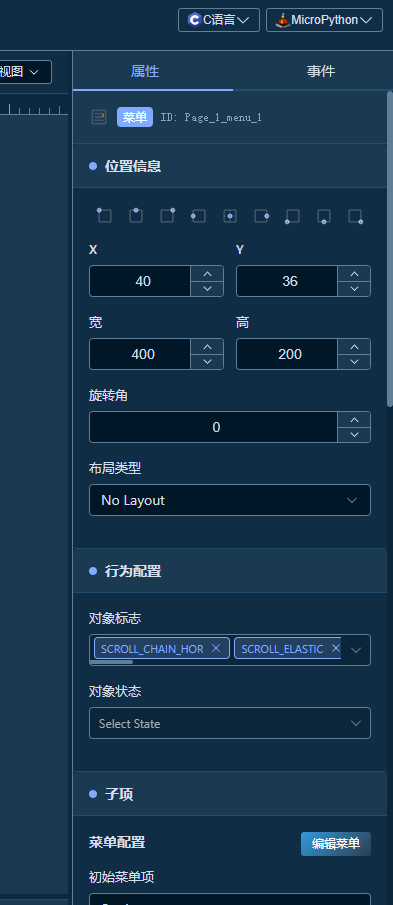
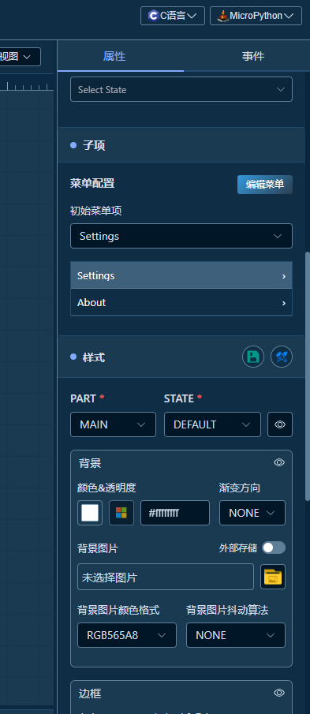
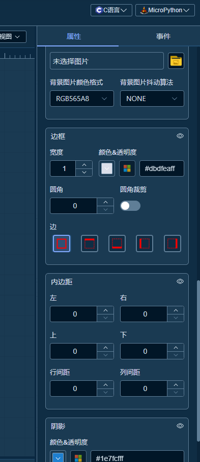
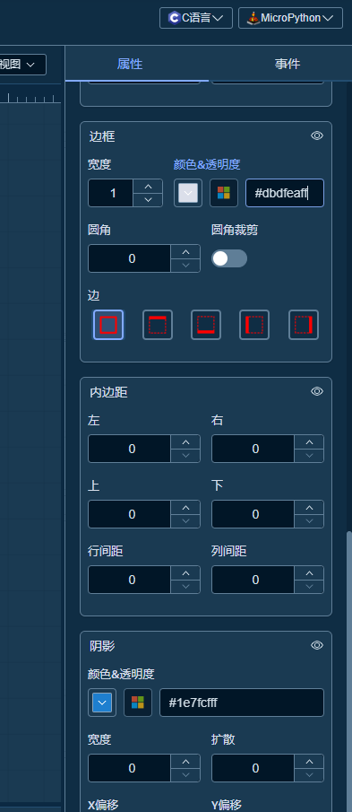
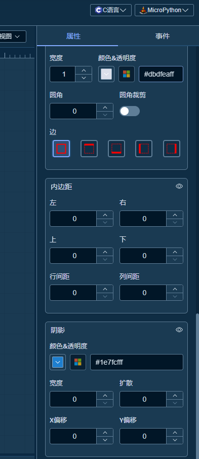

#### 专用属性

（无 `general` 分组专用字段；面板仍含 **位置信息**、**行为配置**、**样式**。）

**扩展数据（extraData，属性面板内嵌编辑器）：**

- `rootPageId`: id of the root menu page.
- `selectedPageId`: page currently shown in the designer; usually the same as `rootPageId` when first created.
- `selectedItemId`: root menu item selected in the designer preview.
- `initialItemId`: root menu item selected when generated code starts.
- `pages[]`: menu pages.
- `pages[].sections[]`: visual groups inside a page.

#### 样式 Part

`main`（MAIN）、`main_sidebar`（SIDEBAR）、`main_item`（ITEM）

> 通用样式子组（背景、字体、边框、阴影、内边距等）见 §4.4.2；多 Part 控件请在 **PART** 下拉中分别编辑 `main` / `indicator` / `knob` 等。

### 5.11.2 标签视图（`tabview`）

**Beken 参照：** `ref/beken/.../component-specs/tabview/tabview.md`；截图 `docs/beken界面/属性面板/标签视图属性/标签视图属性-1.png`～`标签视图属性-4.png`、`-全窗.png`

**Beken 截图：**

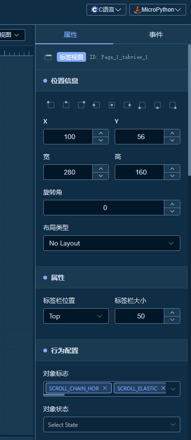
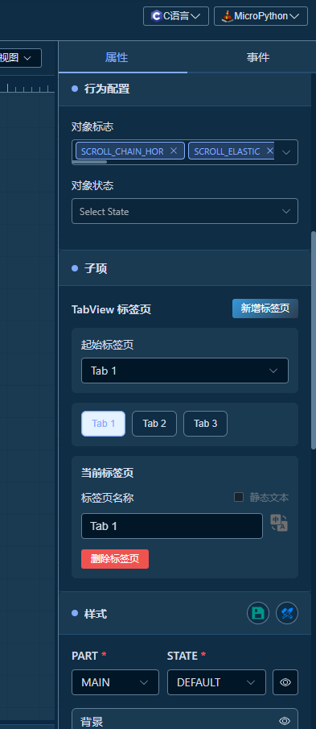
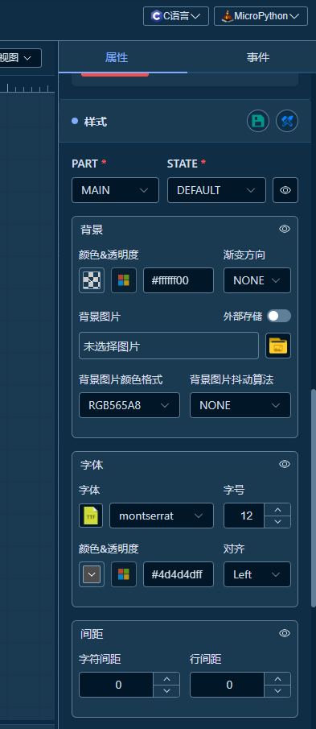
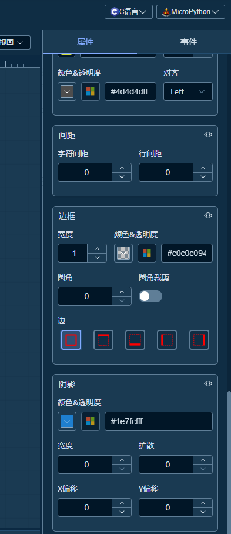

#### 专用属性

| 字段 | Beken UI | 类型 | 默认值 | ForgeUI |
|------|----------|------|--------|---------|
| `tab_bar_size` | tab_bar_size | Common/Number | 50 | ✓ 画布标签栏厚度 |
| `tab_bar_position` | tab_bar_position | Common/Enum | "TOP" | ✓ TOP/BOTTOM/LEFT/RIGHT 画布布局 |

**扩展数据（extraData，属性面板内嵌编辑器）：**

- `tabs[]`: tab header definitions.
- `tabs[].name`: visible tab text（画布标签栏文案）。
- `tabs[].name_i18nEnabled`: optional i18n flag.
- `tabs[].is_name_static`: optional static-text flag.
- `selectedTabIndex`: tab shown in the designer（画布高亮选中项）。
- `initialTabIndex`: tab selected when generated code starts; falls back to `selectedTabIndex` if omitted.

#### 样式 Part

`main`（MAIN）、`main_tabbar`（TABBAR）、`main_tabbaritem`（TABBAR ITEM）

> 通用样式子组（背景、字体、边框、阴影、内边距等）见 §4.4.2；多 Part 控件请在 **PART** 下拉中分别编辑。画布：`buildTabviewChrome` 渲染标签栏；回归 `tests/designer_tabview_prop_display_bk.test.ts`（43 属性项逐项可用）。

### 5.11.3 平铺视图（`tileview`）

**Beken 参照：** `ref/beken/.../component-specs/tileview/tileview.md`；截图 `docs/beken界面/属性面板/平铺视图属性/平铺视图属性-1.png`～`平铺视图属性-5.png`、`-全窗.png`

**Beken 截图：**

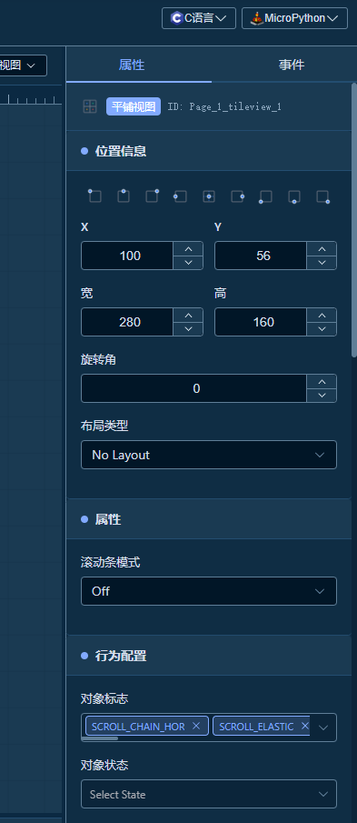
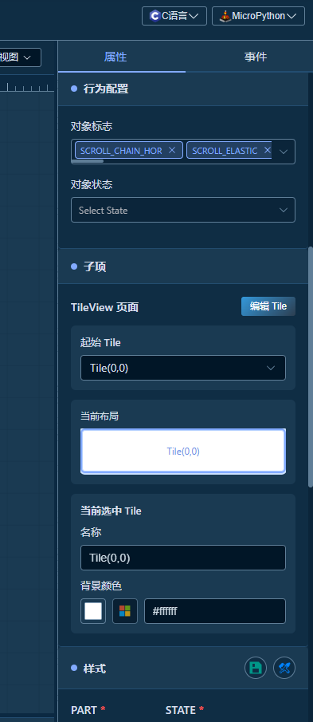
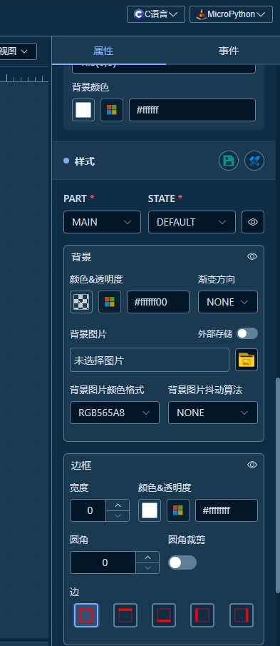
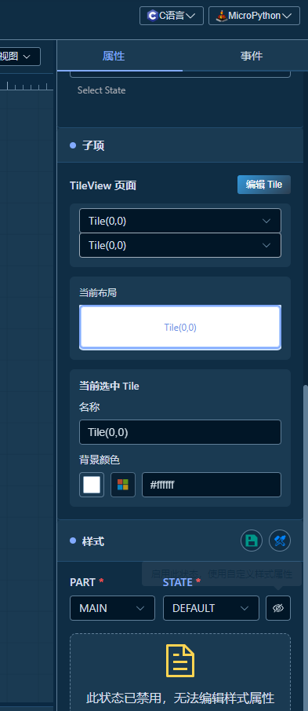
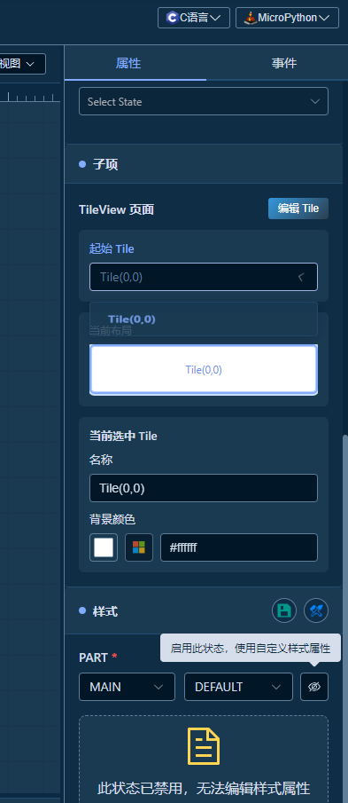

#### 专用属性

| 字段 | Beken UI | 类型 | 默认值 | ForgeUI |
|------|----------|------|--------|---------|
| `scrollbar_mode` | scrollbar_mode | Common/Enum | "OFF" | V1 |

**扩展数据（extraData，属性面板内嵌编辑器）：**

- `tiles[]`: available tile pages.
- `tiles[].id`: stable tile id used by child `layout.tileId`.
- `tiles[].name`: designer display name.
- `tiles[].col`: tile column.
- `tiles[].row`: tile row.
- `tiles[].dir`: allowed scroll direction: `"NONE"`, `"ALL"`, `"LEFT"`, `"RIGHT"`, `"TOP"`, `"BOTTOM"`, `"HOR"`, or `"VER"`.

#### 样式 Part

`main`（MAIN）、`scrollbar`（SCROLLBAR）

> 通用样式子组（背景、字体、边框、阴影、内边距等）见 §4.4.2；多 Part 控件请在 **PART** 下拉中分别编辑 `main` / `indicator` / `knob` 等。

### 5.12 高级类
### 5.12.1 数字时钟（`digitalclock`）

**Beken 参照：** `ref/beken/.../component-specs/digitalclock/digitalclock.md`；截图 `docs/beken界面/属性面板/数字时钟属性/数字时钟属性-1.png`～`数字时钟属性-5.png`、`-全窗.png`

**Beken 截图：**

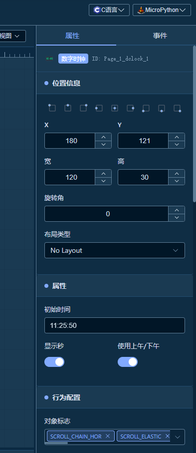
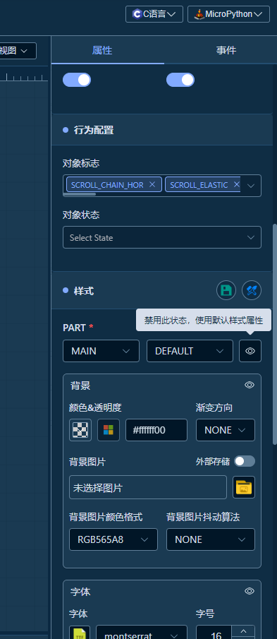
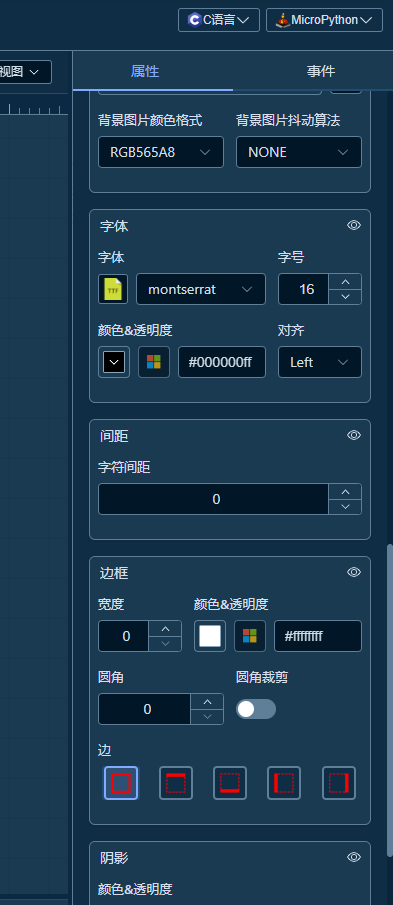
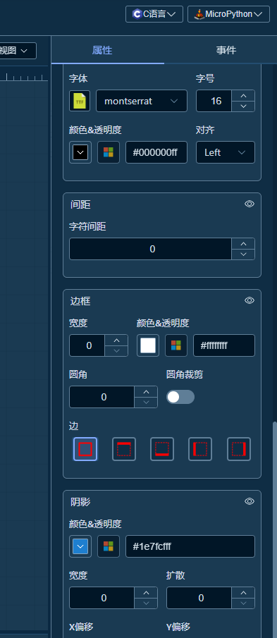


#### 专用属性

| 字段 | Beken UI | 类型 | 默认值 | ForgeUI |
|------|----------|------|--------|---------|
| `initial_time` | initial_time | Common/DateTime | "11:25:50" | V1 |
| `show_second` | show_second | Common/Boolean | true | V1 |
| `use_ampm` | use_ampm | Common/Boolean | true | V1 |

#### 样式 Part

`main`（MAIN）

> 通用样式子组（背景、字体、边框、阴影、内边距等）见 §4.4.2；多 Part 控件请在 **PART** 下拉中分别编辑 `main` / `indicator` / `knob` 等。

### 5.12.2 日历（`calendar`）

**Beken 参照：** `ref/beken/.../component-specs/calendar/calendar.md`；截图 `docs/beken界面/属性面板/日历属性/日历属性-1.png`～`日历属性-5.png`、`-全窗.png`

**Beken 截图：**

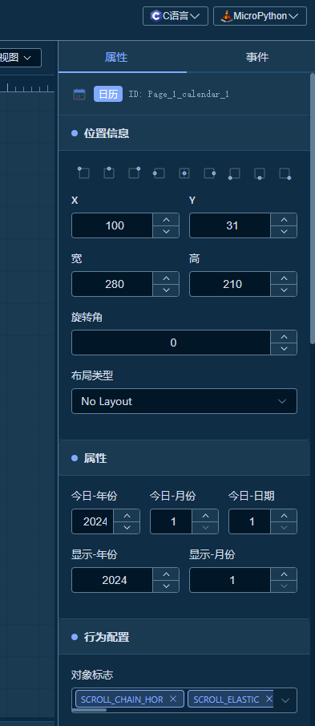
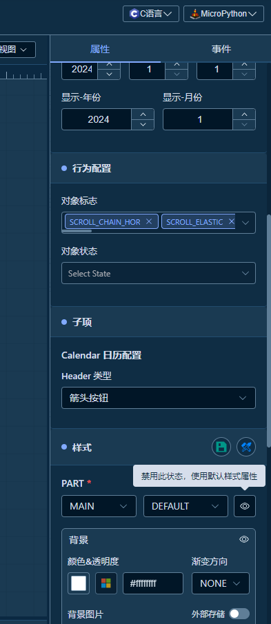
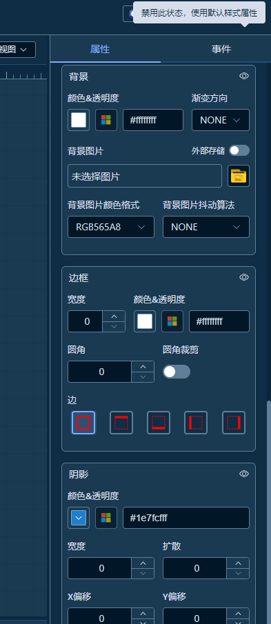
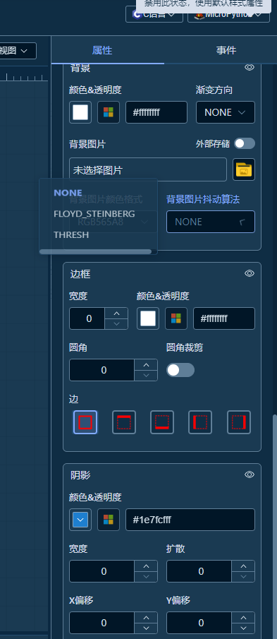
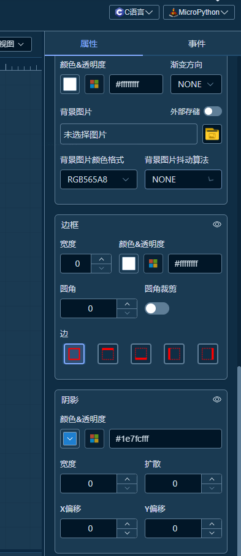

#### 专用属性

| 字段 | Beken UI | 类型 | 默认值 | ForgeUI |
|------|----------|------|--------|---------|
| `today_year` | today_year | Common/Number | 2024 | V1 |
| `today_month` | today_month | Common/Number | 1 | V1 |
| `today_day` | today_day | Common/Number | 1 | V1 |
| `showed_year` | showed_year | Common/Number | 2024 | V1 |
| `showed_month` | showed_month | Common/Number | 1 | V1 |

**扩展数据（extraData，属性面板内嵌编辑器）：**

- `highlighted_dates[]`: dates to highlight.
- `highlighted_dates[].year`: full year.
- `highlighted_dates[].month`: month number, 1-12.
- `highlighted_dates[].day`: day number, 1-31.
- `header_type`: `"arrow"`, `"dropdown"`, or `"none"`.
- `header_years_list`: year options for dropdown headers.

#### 样式 Part

`main`（MAIN）、`main_header`（HEADER）、`main_buttonmatrix`（MAIN_BUTTONMATRIX）、`items_buttonmatrix`（ITEMS_BUTTONMATRIX）

> 通用样式子组（背景、字体、边框、阴影、内边距等）见 §4.4.2；多 Part 控件请在 **PART** 下拉中分别编辑 `main` / `indicator` / `knob` 等。

### 5.12.3 键盘（`keyboard`）

**Beken 参照：** `ref/beken/.../component-specs/keyboard/keyboard.md`；截图 `docs/beken界面/属性面板/键盘属性/键盘属性-1.png`～`键盘属性-5.png`、`-全窗.png`

**Beken 截图：**

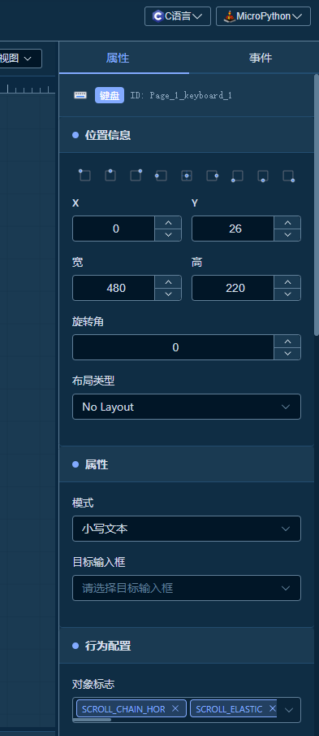
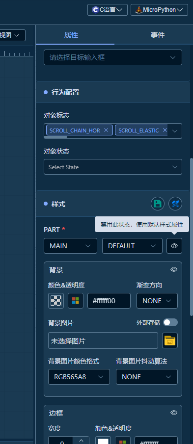
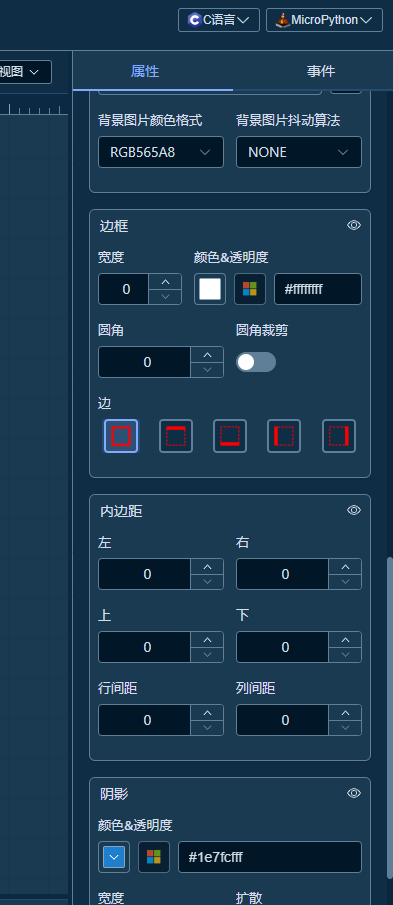
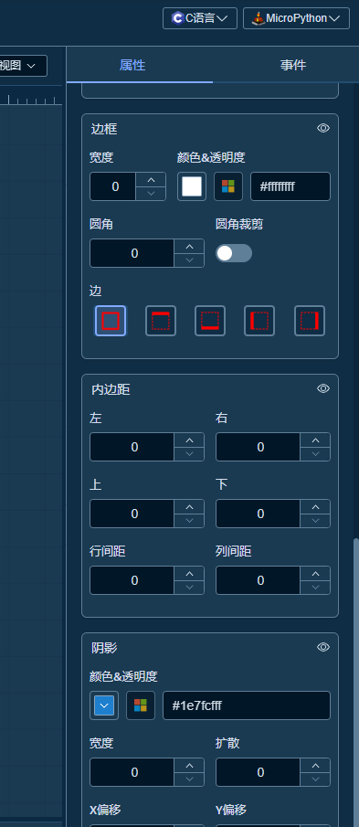
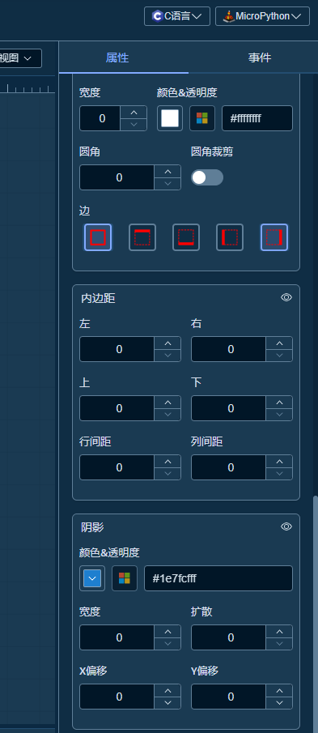

#### 专用属性

| 字段 | Beken UI | 类型 | 默认值 | ForgeUI |
|------|----------|------|--------|---------|
| `mode` | 模式 | Common/Enum | "TEXT_LOWER" | V1 |

#### 样式 Part

`main`（MAIN）、`items`（ITEMS）

> 通用样式子组（背景、字体、边框、阴影、内边距等）见 §4.4.2；多 Part 控件请在 **PART** 下拉中分别编辑 `main` / `indicator` / `knob` 等。

### 5.12.4 刻度（`scale`）

**Beken 参照：** `ref/beken/.../component-specs/scale/scale.md`；截图 `docs/beken界面/属性面板/刻度属性/刻度属性-1.png`～`刻度属性-7.png`、`-全窗.png`

**Beken 截图：**

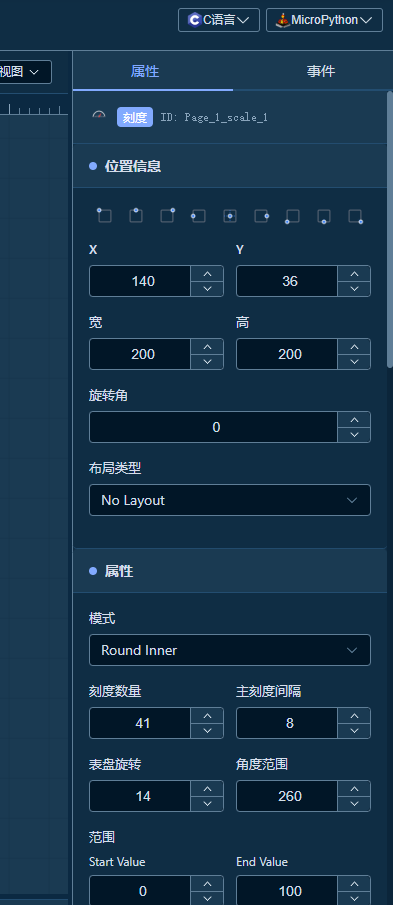
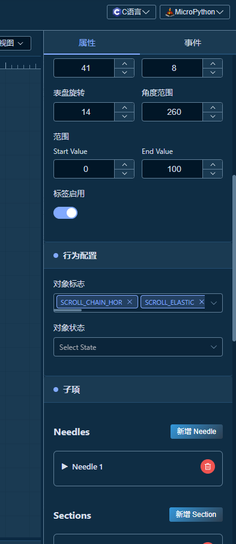
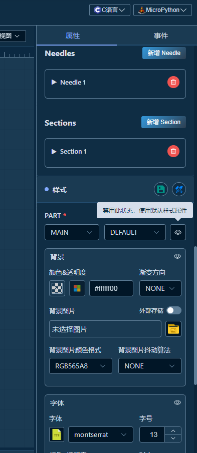
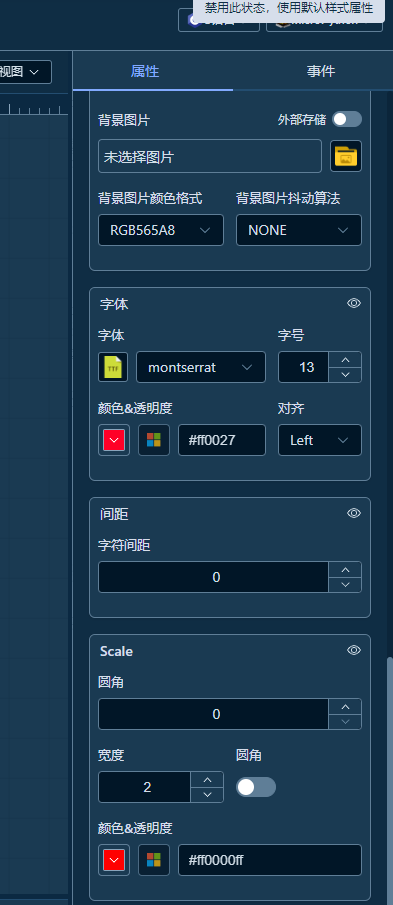
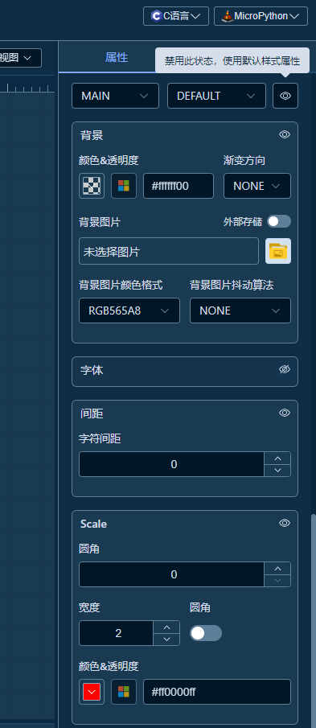
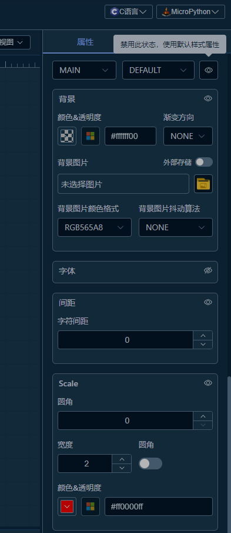
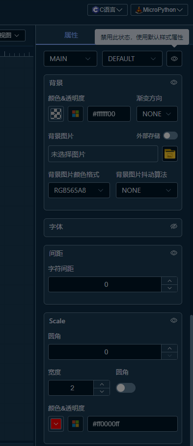

#### 专用属性

| 字段 | Beken UI | 类型 | 默认值 | ForgeUI |
|------|----------|------|--------|---------|
| `tick_cnt` | tick_cnt | Common/Number | 41 | V1 |
| `major_tick_nth` | major_tick_nth | Common/Number | 8 | V1 |
| `rotation` | rotation | Common/Number | 14 | V1 |
| `angle_range` | angle_range | Common/Number | 260 | V1 |
| `range` | 范围 | Common/Range | {"min":0,"max":100} | V1 |
| `label_enable` | label_enable | Common/Boolean | true | V1 |
| `mode` | 模式 | Common/Enum | "ROUND_INNER" | V1 |

**扩展数据（extraData，属性面板内嵌编辑器）：**

- `needles[]`: gauge indicators.
- `needles[].needle_type`: `"line"` or `"image"`.
- `needles[].needle_width`, `needle_color`, `needle_length`, `needle_rounded`: line needle style.
- `needles[].img_path`, `img_width`, `img_height`: image needle asset and size when `needle_type` is `"image"`.
- `needles[].pivot_x`, `pivot_y`: needle pivot.
- `needles[].value`: value pointed to by the needle.

#### 样式 Part

`main`（MAIN）、`items`（ITEMS）、`indicator`（INDICATOR）

> 通用样式子组（背景、字体、边框、阴影、内边距等）见 §4.4.2；多 Part 控件请在 **PART** 下拉中分别编辑 `main` / `indicator` / `knob` 等。

### 5.13 图表类
### 5.13.1 线图（`linechart`）

**Beken 参照：** `ref/beken/.../component-specs/linechart/linechart.md`；截图 `docs/beken界面/属性面板/线图属性/线图属性-1.png`～`线图属性-5.png`、`-全窗.png`

**Beken 截图：**

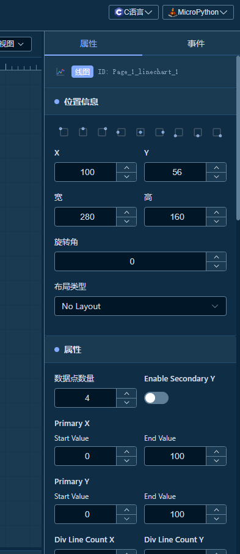
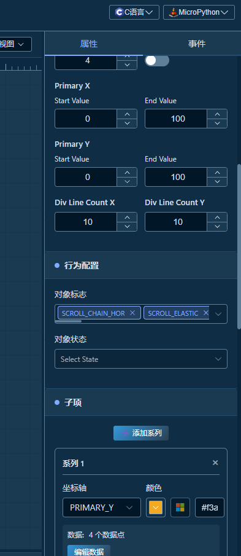
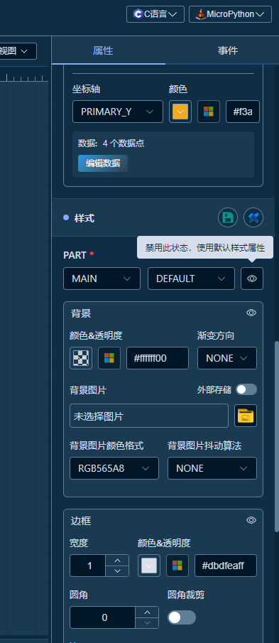
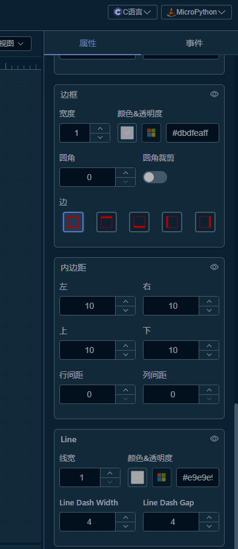
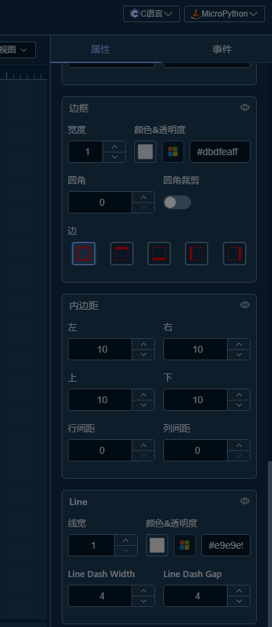

#### 专用属性

| 字段 | Beken UI | 类型 | 默认值 | ForgeUI |
|------|----------|------|--------|---------|
| `point_count` | point_count | Common/Number | 4 | V1 |
| `primary_x` | primary_x | Common/Range | {"min":0,"max":100} | V1 |
| `primary_y` | primary_y | Common/Range | {"min":0,"max":100} | V1 |
| `enable_secondary_y` | enable_secondary_y | Common/Boolean | false | V1 |
| `secondary_y` | secondary_y | Common/Range | {"min":0,"max":100} | V1 |
| `div_line_count_x` | div_line_count_x | Common/Number | 10 | V1 |
| `div_line_count_y` | div_line_count_y | Common/Number | 10 | V1 |

**扩展数据（extraData，属性面板内嵌编辑器）：**

- `series[]`: chart series.
- `series[].color`: series color.
- `series[].axis`: axis id, usually `"PRIMARY_Y"` or `"SECONDARY_Y"`.
- `series[].data[]`: **integer** y-values only (`int32`). Its length should match the `point_count` property.
- `cursors[]`: optional chart cursor data; keep `[]` unless an existing project uses cursors.

#### 样式 Part

`main`（MAIN）

> 通用样式子组（背景、字体、边框、阴影、内边距等）见 §4.4.2；多 Part 控件请在 **PART** 下拉中分别编辑 `main` / `indicator` / `knob` 等。

### 5.13.2 柱状图（`barchart`）

**Beken 参照：** `ref/beken/.../component-specs/barchart/barchart.md`；截图 `docs/beken界面/属性面板/柱状图属性/柱状图属性-1.png`～`柱状图属性-6.png`、`-全窗.png`

**Beken 截图：**

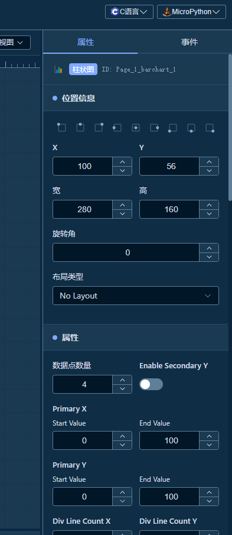
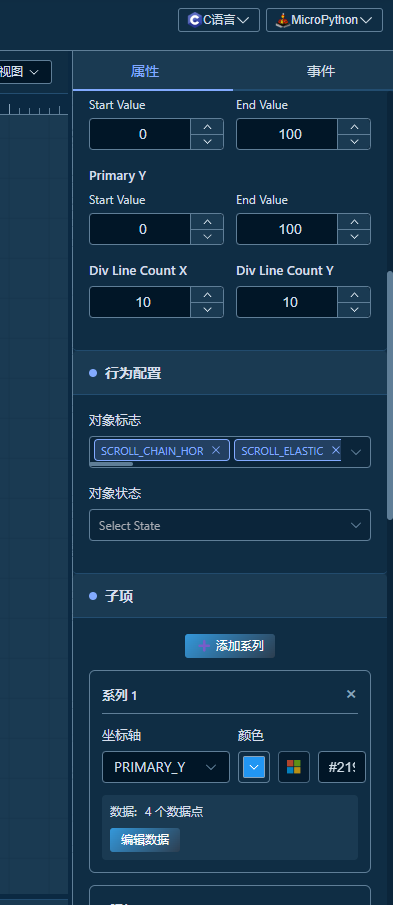
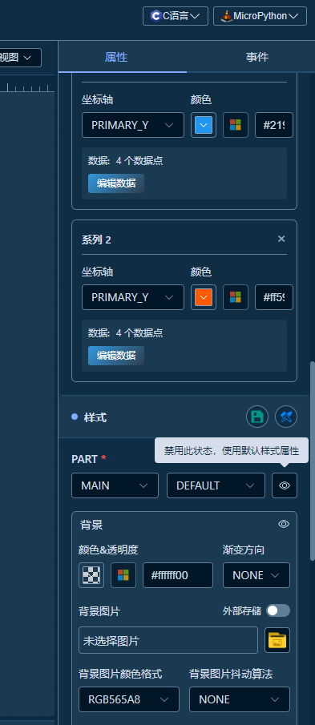
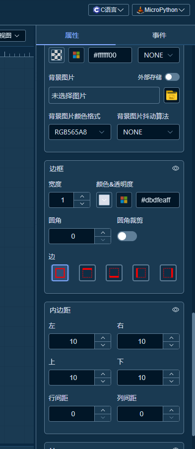
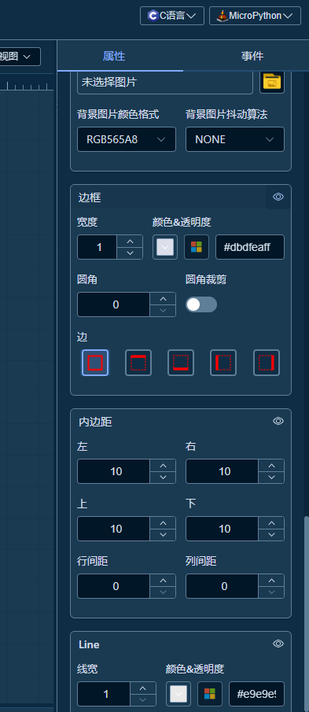
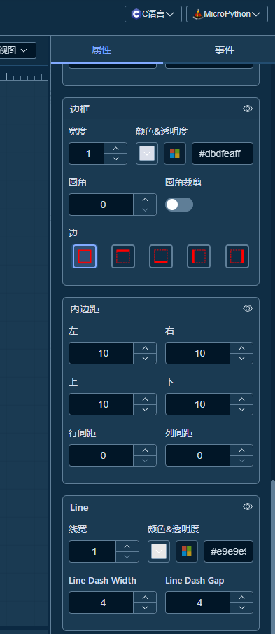

#### 专用属性

| 字段 | Beken UI | 类型 | 默认值 | ForgeUI |
|------|----------|------|--------|---------|
| `point_count` | point_count | Common/Number | 4 | V1 |
| `primary_x` | primary_x | Common/Range | {"min":0,"max":100} | V1 |
| `primary_y` | primary_y | Common/Range | {"min":0,"max":100} | V1 |
| `enable_secondary_y` | enable_secondary_y | Common/Boolean | false | V1 |
| `secondary_y` | secondary_y | Common/Range | {"min":0,"max":100} | V1 |
| `div_line_count_x` | div_line_count_x | Common/Number | 10 | V1 |
| `div_line_count_y` | div_line_count_y | Common/Number | 10 | V1 |

**扩展数据（extraData，属性面板内嵌编辑器）：**

- `series[]`: chart series.
- `series[].color`: series color.
- `series[].axis`: axis id, usually `"PRIMARY_Y"` or `"SECONDARY_Y"`.
- `series[].data[]`: **integer** bar values only (`int32`). Its length should match the `point_count` property.
- `cursors[]`: optional chart cursor data; keep `[]` unless an existing project uses cursors.

#### 样式 Part

`main`（MAIN）

> 通用样式子组（背景、字体、边框、阴影、内边距等）见 §4.4.2；多 Part 控件请在 **PART** 下拉中分别编辑 `main` / `indicator` / `knob` 等。

### 5.13.3 散点图（`scatterchart`）

**Beken 参照：** `ref/beken/.../component-specs/scatterchart/scatterchart.md`；截图 `docs/beken界面/属性面板/散点图属性/散点图属性-1.png`～`散点图属性-5.png`、`-全窗.png`

**Beken 截图：**

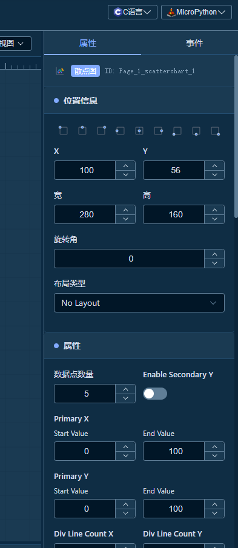
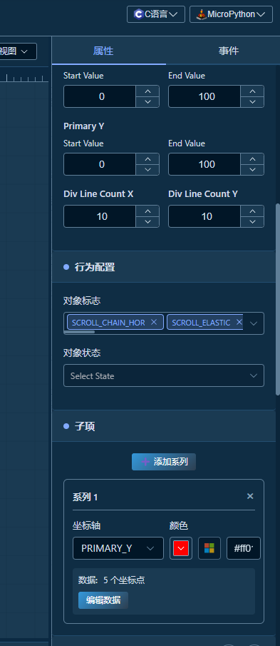
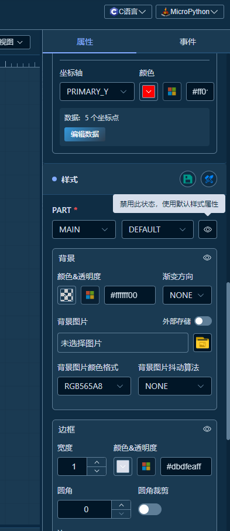
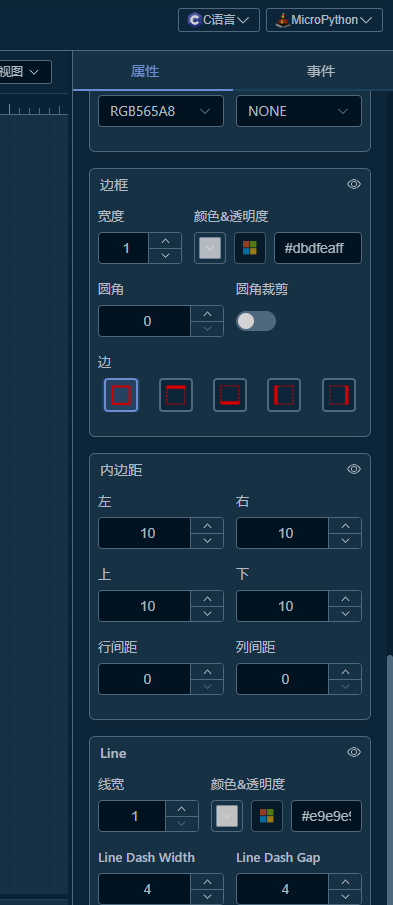
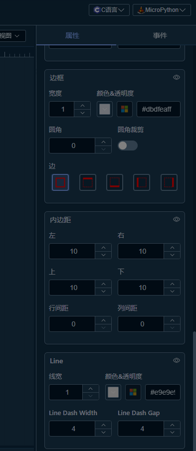

#### 专用属性

| 字段 | Beken UI | 类型 | 默认值 | ForgeUI |
|------|----------|------|--------|---------|
| `point_count` | point_count | Common/Number | 5 | V1 |
| `primary_x` | primary_x | Common/Range | {"min":0,"max":100} | V1 |
| `primary_y` | primary_y | Common/Range | {"min":0,"max":100} | V1 |
| `enable_secondary_y` | enable_secondary_y | Common/Boolean | false | V1 |
| `secondary_y` | secondary_y | Common/Range | {"min":0,"max":100} | V1 |
| `div_line_count_x` | div_line_count_x | Common/Number | 10 | V1 |
| `div_line_count_y` | div_line_count_y | Common/Number | 10 | V1 |

**扩展数据（extraData，属性面板内嵌编辑器）：**

- `series[]`: chart series.
- `series[].color`: series color.
- `series[].axis`: axis id, usually `"PRIMARY_Y"` or `"SECONDARY_Y"`.
- `series[].data.x[]`: **integer** x-values only (`int32`).
- `series[].data.y[]`: **integer** y-values only (`int32`). The `x` and `y` arrays should have the same length and match the `point_count` property.
- `cursors[]`: optional chart cursor data; keep `[]` unless an existing project uses cursors.

#### 样式 Part

`main`（MAIN）、`items`（ITEMS）

> 通用样式子组（背景、字体、边框、阴影、内边距等）见 §4.4.2；多 Part 控件请在 **PART** 下拉中分别编辑 `main` / `indicator` / `knob` 等。

### 5.13.4 chart（`chart`）

**Beken 参照：** `ref/beken/.../component-specs/chart/chart.md`；截图目录 `docs/beken界面/属性面板/chart属性/`（**暂无截图**，见 component-specs）

#### 专用属性

| 字段 | Beken UI | 类型 | 默认值 | ForgeUI |
|------|----------|------|--------|---------|
| `point_count` | point_count | Common/Number | 10 | V1 |
| `div_line_count_h` | div_line_count_h | Common/Number | 5 | V1 |
| `div_line_count_v` | div_line_count_v | Common/Number | 5 | V1 |
| `range_min` | 最小值 | Common/Number | 0 | V1 |
| `range_max` | 最大值 | Common/Number | 100 | V1 |
| `zoom_x` | zoom_x | Common/Number | 256 | V1 |
| `zoom_y` | zoom_y | Common/Number | 256 | V1 |
| `chart_type` | chart_type | Common/Enum | "LINE" | V1 |

#### 样式 Part

`main`（MAIN）、`series`（SERIES）

> 通用样式子组（背景、字体、边框、阴影、内边距等）见 §4.4.2；多 Part 控件请在 **PART** 下拉中分别编辑 `main` / `indicator` / `knob` 等。


---

## 6. 事件面板（「事件」Tab）

点击右栏顶栏 **「事件」** Tab 进入；选中非 screen 控件时可编辑。与 **「属性」** Tab 互斥显示，内容区占满右栏剩余高度并可滚动。

| 项 | 说明 |
|----|------|
| 触发器 | `CLICKED`、`PRESSED`、`RELEASED`、`LONG_PRESSED`、`VALUE_CHANGED` |
| 动作 MVP | **切页**（`CHANGE_SCREEN`）、**Call function**（`CALL_FUNCTION`） |
| 写回 | `project:setEvents` → `node.events[]` |

按钮、图片常见：`CLICKED` → 切页或调用 C 处理函数。标签通常无事件，面板显示空列表时可 **+ 事件** 添加。

---

## 7. MVP 与规划能力对照

| 能力 | Beken | ForgeUI MVP | ForgeUI V1 |
|------|-------|-------------|------------|
| 属性/事件 Tab 切换 | ✓（顶栏 Tab） | ✓ | ✓ |
| 位置 X/Y/W/H | ✓ | ✓ | ✓ |
| 锚点 / 旋转 / 布局 | ✓ | — | ✓ |
| 全 38 种控件属性（见 §5） | ✓ | 部分 | V1 |
| 图片 src + 资源管理 | ✓ | ✓（路径） | 可视化选择器 |
| 长文本模式 | ✓ | — | ✓ |
| 行为标志 / 状态 | ✓ | — | ✓ |
| Part/State 下拉 | ✓ | 固定 main/default | ✓ |
| 背景/字体/边框/阴影全量 | ✓ | 部分字段 | ✓ |
| 样式库 保存/样式库入口 | ✓ | — | FR-018 |
| 颜色库引用 | ✓ | — | V1 |

当前实现文件：`InspectorPanel.vue`（Tab 容器）+ `PropPanel.vue` + `EventPanel.vue`；属性区字段以 MVP 最小表单为主，完整 UI 以本章及详设 §9.7.4 为验收基准逐步补齐。

---

## 8. 与工程 JSON 的对应关系

| UI 分组 | 工程字段 | 持久化路径 |
|---------|----------|------------|
| 位置信息 | `frame` | `screens/<screenId>.json` 内节点 |
| 属性 | `props` | 同上 |
| 样式 | `style` 或 `style.parts` | 同上 |
| 事件 | `events` | 同上 |
| 身份 id/type | 只读 | 创建时分配，不可改 type |

CodeGen 读取磁盘 JSON；**务必存档**后再生成，否则仿真与画布不一致。

---

## 9. 常见问题

**Q：改了属性但仿真里没变？**  
A：先 **存档**，再执行「生成代码+编译+模拟运行」。生成流程会自动存档，但仅预览旧产物时仍可能不一致。

**Q：属性面板是灰的 / 无字段？**  
A：确认已打开工程且选中了具体控件（不是空白画布）。screen 根节点字段较少。

**Q：首组是「屏幕信息」还是「位置信息」？**  
A：页面树选中 **Page_x** → **屏幕信息**（无锚点格）；画布/组件树选中控件 → **位置信息**（有 3×3 锚点格）。截图脚本分别用 `--page-only` 与 `--shot-only`。

**Q：找不到图片路径选择？**  
A：MVP 可在 `props.src` 手填相对路径；先在 **资源管理** 导入文件。

**Q：样式 Part/State 与 Beken 不一致？**  
A：V1 前默认编辑 **MAIN + DEFAULT**；按 §4.4.1 表扩展 INDICATOR/KNOB 等于 V1 起支持。

**Q：属性面板和控件库有什么关系？**  
A：顶栏「控件库」**只**显示/隐藏左侧控件库，**不会**隐藏右侧属性/事件检查器（FR-010a）。

**Q：如何编辑控件事件？**  
A：在右栏顶栏点击 **「事件」** Tab，选中非 screen 控件后即可添加/编辑 `events[]`；编辑属性时切回 **「属性」** Tab。

---

## 10. 相关文档

| 文档 | 路径 |
|------|------|
| Beken 属性面板原文 | `docs/beken界面/属性面板/属性面板说明.txt` |
| 属性面板截图规范 | `docs/beken界面/属性面板/README.md` |
| 截图脚本 | `.tmp/capture_component_props.py` |
| 工作区布局 | `docs/beken界面/界面说明.txt` §2.14 |
| 控件库边界 | `docs/beken界面/组件面板/控件库面板-本产品映射.md` |
| 页面组件树 | `docs/beken界面/组件面板/页面组件树-本产品映射.md` |
| 软件详设 | `docs/嵌入式UI工具_软件详细设计说明.md` §9.7.4 |
| 属性面板模块详设 | `docs/嵌入式UI工具_控件属性面板详细设计说明.md` |
| Widget 注册表 | `packages/core/src/widgets.ts` |
| Beken AI 组件规格 | `ref/beken/.../ai-skill/.../component-specs/README.md` |
| Beken 属性/样式 AI 指南 | `ref/beken/.../ai-skill/.../style-guidelines.md` |

---

## 11. 附录

### 11.1 Beken 截图索引

截图均裁剪**右侧属性面板滚动区**；长面板按 `-1`～`-N` 分段，`-全窗.png` 为同次截取的全窗口参考。

**截取脚本：** `.tmp/capture_component_props.py`

- 控件：`python .tmp/capture_component_props.py --shot-only <中文名>`
- 页面：`python .tmp/capture_component_props.py --page-only`

| 对象 | 目录 | 张数 | 首组 |
|------|------|------|------|
| 页面 | [页面属性/](../beken界面/属性面板/页面属性/) | 1 | 屏幕信息 |
| LED | [LED属性/](../beken界面/属性面板/LED属性/) | 3 | 位置信息 |
| 下拉菜单 | [下拉菜单属性/](../beken界面/属性面板/下拉菜单属性/) | 4 | 位置信息 |
| 二维码 | [二维码属性/](../beken界面/属性面板/二维码属性/) | 4 | 位置信息 |
| 列表 | [列表属性/](../beken界面/属性面板/列表属性/) | 6 | 位置信息 |
| 刻度 | [刻度属性/](../beken界面/属性面板/刻度属性/) | 7 | 位置信息 |
| 加载动画 | [加载动画属性/](../beken界面/属性面板/加载动画属性/) | 3 | 位置信息 |
| 动画图片 | [动画图片属性/](../beken界面/属性面板/动画图片属性/) | 6 | 位置信息 |
| 图片 | [图片属性/](../beken界面/属性面板/图片属性/) | 6 | 位置信息 |
| 图片按钮 | [图片按钮属性/](../beken界面/属性面板/图片按钮属性/) | 6 | 位置信息 |
| 圆弧 | [圆弧属性/](../beken界面/属性面板/圆弧属性/) | 5 | 位置信息 |
| 复选框 | [复选框属性/](../beken界面/属性面板/复选框属性/) | 6 | 位置信息 |
| 容器 | [容器属性/](../beken界面/属性面板/容器属性/) | 3 | 位置信息 |
| 平铺视图 | [平铺视图属性/](../beken界面/属性面板/平铺视图属性/) | 5 | 位置信息 |
| 开关 | [开关属性/](../beken界面/属性面板/开关属性/) | 6 | 位置信息 |
| 按钮 | [按钮属性/](../beken界面/属性面板/按钮属性/) | 6 | 位置信息 |
| 按钮矩阵 | [按钮矩阵属性/](../beken界面/属性面板/按钮矩阵属性/) | 6 | 位置信息 |
| 散点图 | [散点图属性/](../beken界面/属性面板/散点图属性/) | 5 | 位置信息 |
| 数字时钟 | [数字时钟属性/](../beken界面/属性面板/数字时钟属性/) | 5 | 位置信息 |
| 数字输入框 | [数字输入框属性/](../beken界面/属性面板/数字输入框属性/) | 4 | 位置信息 |
| 文本域 | [文本域属性/](../beken界面/属性面板/文本域属性/) | 6 | 位置信息 |
| 文本组 | [文本组属性/](../beken界面/属性面板/文本组属性/) | 6 | 位置信息 |
| 日历 | [日历属性/](../beken界面/属性面板/日历属性/) | 5 | 位置信息 |
| 条形码 | [条形码属性/](../beken界面/属性面板/条形码属性/) | 5 | 位置信息 |
| 柱状图 | [柱状图属性/](../beken界面/属性面板/柱状图属性/) | 6 | 位置信息 |
| 标签 | [标签属性/](../beken界面/属性面板/标签属性/) | 6 | 位置信息 |
| 标签视图 | [标签视图属性/](../beken界面/属性面板/标签视图属性/) | 4 | 位置信息 |
| 消息框 | [消息框属性/](../beken界面/属性面板/消息框属性/) | 5 | 位置信息 |
| 滑块 | [滑块属性/](../beken界面/属性面板/滑块属性/) | 6 | 位置信息 |
| 滚轮 | [滚轮属性/](../beken界面/属性面板/滚轮属性/) | 5 | 位置信息 |
| 画布 | [画布属性/](../beken界面/属性面板/画布属性/) | 6 | 位置信息 |
| 窗口 | [窗口属性/](../beken界面/属性面板/窗口属性/) | 3 | 位置信息 |
| 线图 | [线图属性/](../beken界面/属性面板/线图属性/) | 5 | 位置信息 |
| 线条 | [线条属性/](../beken界面/属性面板/线条属性/) | 3 | 位置信息 |
| 菜单 | [菜单属性/](../beken界面/属性面板/菜单属性/) | 5 | 位置信息 |
| 表格 | [表格属性/](../beken界面/属性面板/表格属性/) | 6 | 位置信息 |
| 进度条 | [进度条属性/](../beken界面/属性面板/进度条属性/) | 5 | 位置信息 |
| 键盘 | [键盘属性/](../beken界面/属性面板/键盘属性/) | 5 | 位置信息 |

#### 分段链接（按钮示例）

- 按钮 [1](../beken界面/属性面板/按钮属性/按钮属性-1.png)
- 按钮 [2](../beken界面/属性面板/按钮属性/按钮属性-2.png)
- 按钮 [3](../beken界面/属性面板/按钮属性/按钮属性-3.png)
- 按钮 [4](../beken界面/属性面板/按钮属性/按钮属性-4.png)
- 按钮 [5](../beken界面/属性面板/按钮属性/按钮属性-5.png)
- 按钮 [6](../beken界面/属性面板/按钮属性/按钮属性-6.png)

其余控件将 `{中文名}属性` 代入上表目录；各 §5 小节内已嵌入截图。

### 11.2 AI component-specs 路径索引

| type | 规格文件 |
|------|----------|
| `obj` | `component-specs/obj/obj.md` |
| `win` | `component-specs/win/win.md` |
| `label` | `component-specs/label/label.md` |
| `spangroup` | `component-specs/spangroup/spangroup.md` |
| `table` | `component-specs/table/table.md` |
| `list` | `component-specs/list/list.md` |
| `button` | `component-specs/button/button.md` |
| `imagebutton` | `component-specs/imagebutton/imagebutton.md` |
| `buttonmatrix` | `component-specs/buttonmatrix/buttonmatrix.md` |
| `textarea` | `component-specs/textarea/textarea.md` |
| `checkbox` | `component-specs/checkbox/checkbox.md` |
| `switch` | `component-specs/switch/switch.md` |
| `slider` | `component-specs/slider/slider.md` |
| `dropdown` | `component-specs/dropdown/dropdown.md` |
| `roller` | `component-specs/roller/roller.md` |
| `spinbox` | `component-specs/spinbox/spinbox.md` |
| `image` | `component-specs/image/image.md` |
| `animimg` | `component-specs/animimg/animimg.md` |
| `canvas` | `component-specs/canvas/canvas.md` |
| `arc` | `component-specs/arc/arc.md` |
| `line` | `component-specs/line/line.md` |
| `qrcode` | `component-specs/qrcode/qrcode.md` |
| `barcode` | `component-specs/barcode/barcode.md` |
| `led` | `component-specs/led/led.md` |
| `bar` | `component-specs/bar/bar.md` |
| `spinner` | `component-specs/spinner/spinner.md` |
| `msgbox` | `component-specs/msgbox/msgbox.md` |
| `menu` | `component-specs/menu/menu.md` |
| `tabview` | `component-specs/tabview/tabview.md` |
| `tileview` | `component-specs/tileview/tileview.md` |
| `digitalclock` | `component-specs/digitalclock/digitalclock.md` |
| `calendar` | `component-specs/calendar/calendar.md` |
| `keyboard` | `component-specs/keyboard/keyboard.md` |
| `scale` | `component-specs/scale/scale.md` |
| `linechart` | `component-specs/linechart/linechart.md` |
| `barchart` | `component-specs/barchart/barchart.md` |
| `scatterchart` | `component-specs/scatterchart/scatterchart.md` |
| `chart` | `component-specs/chart/chart.md` |
