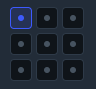

# 控件属性 · 位置信息 3×3 方位格（对标 Beken）

## 问题

当前实现九个格的指示点都在格子**正中央**（见图），无法示意「左上 / 上中 / … / 右下」；且点击仅 `reanchorFrame`（改枢轴、画面不移动），不符合 Beken「对齐到父容器」行为。

## 设计结论

权威契约写入：

- `docs/嵌入式UI工具_控件属性面板详细设计说明.md` **§3.5**
- `docs/工具详细说明手册/控件属性面板使用说明.md` §3.2 / §4.1
- `docs/软件详细设计/09-设计器界面详细设计.md` §9.7.4.2

要点：

1. **示意**：每格指示点落在该格对应方位。  
2. **行为**：点击吸附到**直接父容器**九宫；写 `frame.x/y` + `anchorX/Y`。  
3. **非**：随意空白位移；仅改锚点不动画面。

## 实现入口

- Core：`packages/core/src/frame-anchor.ts` → `alignFrameToParent`  
- UI：`apps/designer/src/components/prop-panel/LayoutGroup.vue`
